# 📖 Hướng dẫn sử dụng Tuấn Chatbot

> Toàn bộ thời gian trong hệ thống dùng **giờ Việt Nam (UTC+7)** ·
> Phiên bản đang chạy luôn hiện ở **chân trang** và tại `/changelog.php`

---

## Mục lục

1. [Giới thiệu](#1-giới-thiệu)
2. [Cài đặt](#2-cài-đặt)
3. [Đăng ký & đăng nhập](#3-đăng-ký--đăng-nhập)
4. [Trò chuyện với AI](#4-trò-chuyện-với-ai)
5. [Quản lý tài khoản](#5-quản-lý-tài-khoản)
6. [Khu vực quản trị](#6-khu-vực-quản-trị)
7. [Câu hỏi thường gặp](#7-câu-hỏi-thường-gặp)

---

## 1. Giới thiệu

Tuấn Chatbot là chatbot AI viết bằng **PHP + HTML + CSS thuần**, chạy được ngay trên
shared hosting bình thường — không cần Composer, không cần Node.js, không cần VPS.

**Ba điểm đáng chú ý:**

| | |
|---|---|
| 🗄️ **Không tốn inode** | Tệp đính kèm và phiên đăng nhập đều nằm trong MySQL. Ứng dụng chỉ gồm khoảng 55 tệp mã nguồn và con số đó **không tăng** dù có bao nhiêu người dùng. |
| 🔌 **Dùng được mọi dịch vụ AI** | OpenAI, Anthropic, Google Gemini, Ollama và mọi dịch vụ tương thích OpenAI (OpenRouter, Groq, DeepSeek, Together…). |
| 🇻🇳 **Tiếng Việt trọn vẹn** | Toàn bộ giao diện, thông báo lỗi và tài liệu đều bằng tiếng Việt; lưu đúng dấu và emoji nhờ `utf8mb4`. |

---

## 2. Cài đặt

### 2.1. Chuẩn bị

| Cần có | Ghi chú |
|---|---|
| Hosting PHP **7.4+** | Đã thử trên 7.4 → 8.4 |
| MySQL **5.7+** hoặc MariaDB **10.2+** | Bộ mã `utf8mb4` |
| Phần mở rộng `pdo_mysql`, `curl`, `mbstring`, `json` | Bắt buộc |
| Phần mở rộng `openssl`, `zip`, `fileinfo` | Rất nên có |
| Một **API key** của dịch vụ AI | Có thể thêm sau |

### 2.2. Tạo database

Vào **cPanel → MySQL Databases** (hoặc DirectAdmin tương ứng):

1. Tạo database mới, chọn bộ mã `utf8mb4`.
2. Tạo user MySQL và **gán toàn quyền** cho database đó.
3. Ghi lại ba thông tin: **tên database**, **tên user**, **mật khẩu**.

### 2.3. Tải mã nguồn lên

Giải nén toàn bộ gói `tuan-chatbot-x.y.z.zip` vào `public_html/`
(hoặc một thư mục con nếu bạn muốn đặt ở đường dẫn phụ như `/chatbot`).

Cấp quyền:

```
config/                → 755   (bắt buộc, để trình cài đặt ghi file cấu hình)
includes/version.php   → 664   (chỉ cần nếu muốn tăng phiên bản từ trang quản trị)
CHANGELOG.md           → 664   (chỉ cần nếu muốn tăng phiên bản từ trang quản trị)
```

> 💡 **Không cần** thư mục nào khác ghi được. Không có thư mục `uploads/` —
> tệp đính kèm nằm trong database.

### 2.4. Chạy trình cài đặt

Mở `https://ten-mien-cua-ban/install.php`.

#### Bước 1 — Kiểm tra máy chủ

Trình cài đặt tự dò từng phần mở rộng PHP và quyền ghi. Mục nào ghi
*"tuỳ chọn"* thì thiếu vẫn chạy được, chỉ mất một ít tính năng.

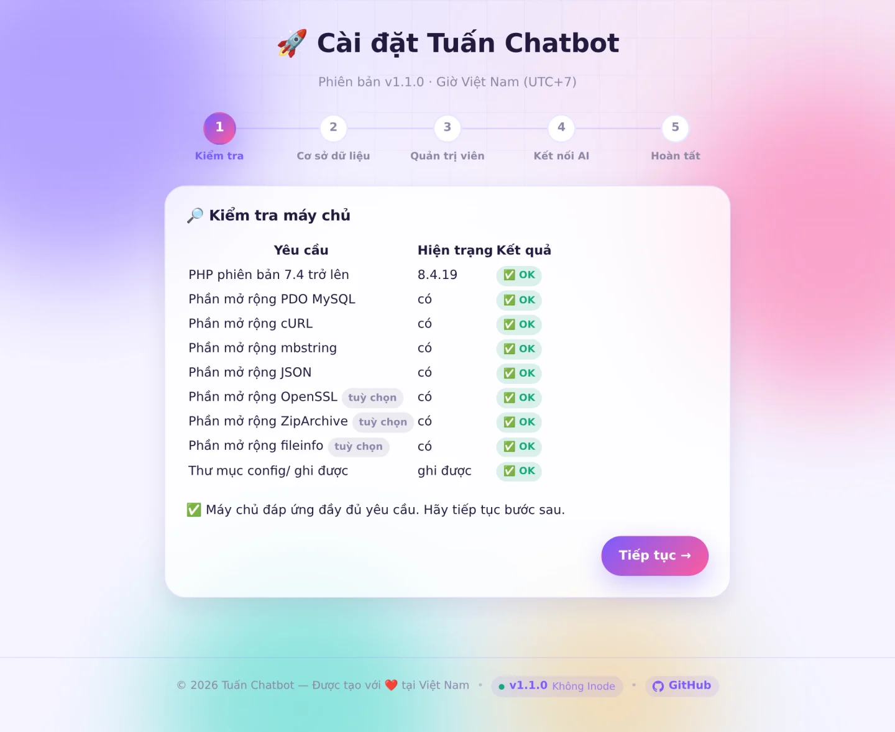

#### Bước 2 — Kết nối cơ sở dữ liệu

Nhập ba thông tin đã ghi ở mục 2.2. Máy chủ thường là `localhost`.

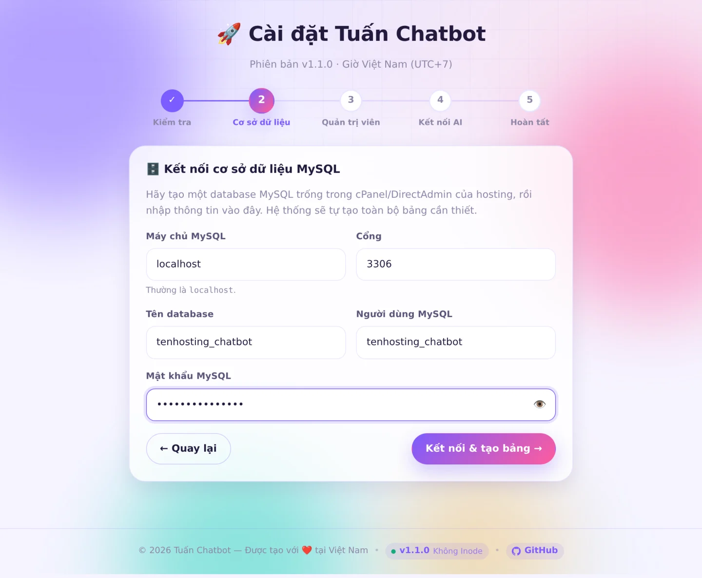

Bấm **Kết nối & tạo bảng** — hệ thống tự tạo toàn bộ 12 bảng và ghi file
`config/config.php` (kèm một khoá mã hoá ngẫu nhiên 64 ký tự để bảo vệ API key).

> ⚠️ Nếu báo *"Access denied"*: kiểm tra lại user MySQL đã được gán quyền cho
> đúng database chưa. Nếu báo *"Không ghi được file config/config.php"*: đặt lại
> quyền `755` cho thư mục `config/`.

#### Bước 3 — Tạo tài khoản quản trị

Tài khoản này có toàn quyền: xem lịch sử chat của mọi người, cấu hình AI API,
quản lý người dùng. Đặt luôn **tên website** và **dòng bản quyền ở chân trang**
tại đây (sửa lại sau được).

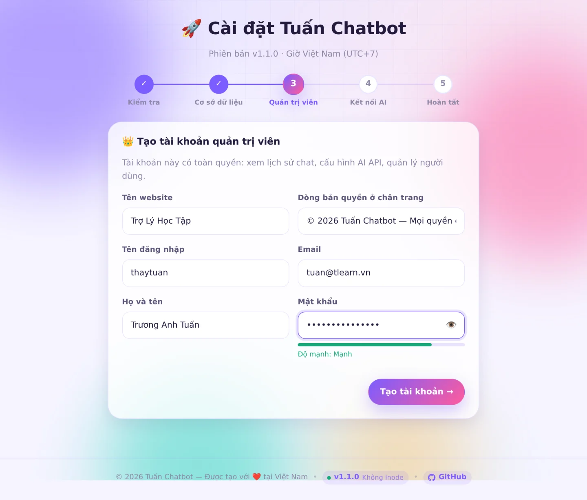

#### Bước 4 — Kết nối AI đầu tiên

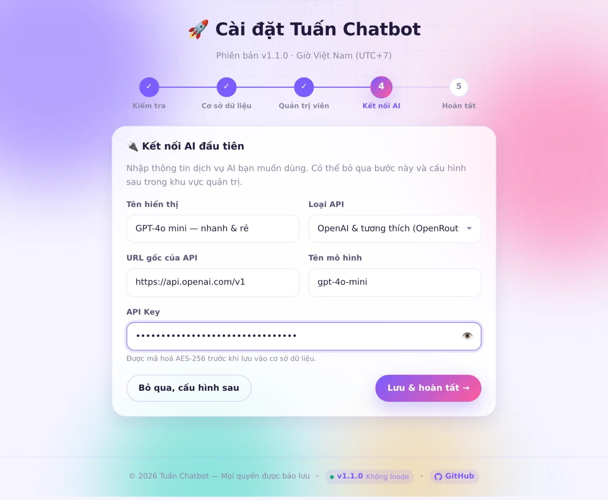

Gợi ý cấu hình cho các dịch vụ phổ biến:

| Dịch vụ | Loại API | URL gốc | Mô hình ví dụ |
|---|---|---|---|
| OpenAI | `openai` | `https://api.openai.com/v1` | `gpt-4o-mini` |
| Anthropic Claude | `anthropic` | `https://api.anthropic.com/v1` | `claude-sonnet-4-20250514` |
| Google Gemini | `gemini` | `https://generativelanguage.googleapis.com/v1beta` | `gemini-2.0-flash` |
| OpenRouter | `openai` | `https://openrouter.ai/api/v1` | `openai/gpt-4o-mini` |
| DeepSeek | `openai` | `https://api.deepseek.com/v1` | `deepseek-chat` |
| Groq | `openai` | `https://api.groq.com/openai/v1` | `llama-3.3-70b-versatile` |
| Ollama (máy nội bộ) | `ollama` | `http://localhost:11434` | `llama3.1` |

Có thể bấm **Bỏ qua, cấu hình sau** rồi thêm trong khu vực quản trị.

#### Bước 5 — Hoàn tất

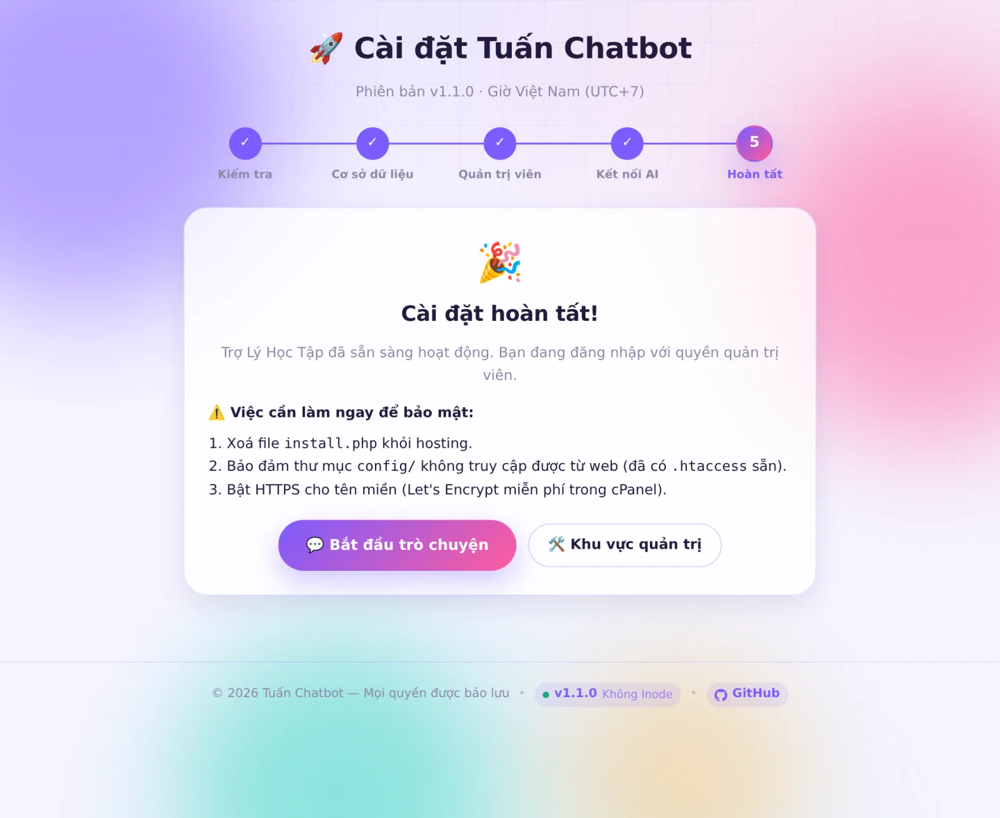

**Ba việc cần làm ngay:**

1. ❗ **Xoá file `install.php`** khỏi hosting.
2. Bật **HTTPS** cho tên miền (Let's Encrypt miễn phí trong cPanel).
3. Kiểm tra `config/.htaccess` vẫn còn nguyên.

---

## 3. Đăng ký & đăng nhập

### 3.1. Đăng nhập

Đăng nhập bằng **tên đăng nhập hoặc email**, tuỳ bạn tiện cái nào.
Tuỳ chọn *Ghi nhớ đăng nhập* giữ phiên 30 ngày.

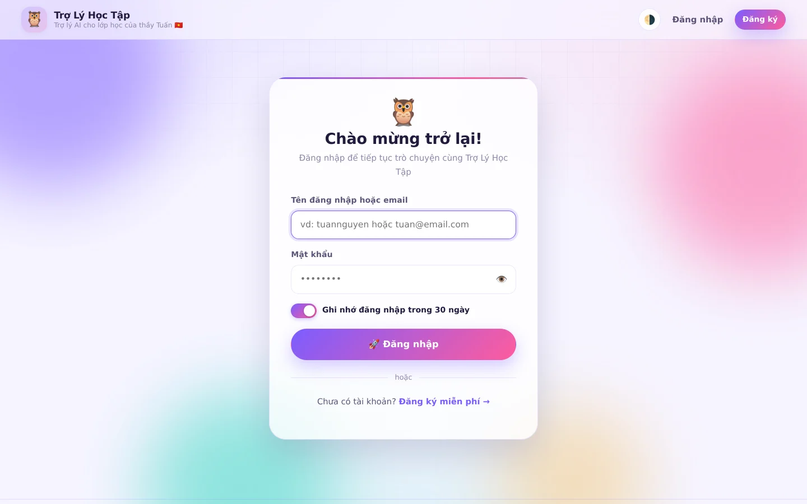

Nút 🌗 ở góc trên đổi giữa giao diện sáng và tối. Lựa chọn được **lưu vào tài khoản**
nên đồng bộ trên mọi thiết bị bạn đăng nhập.

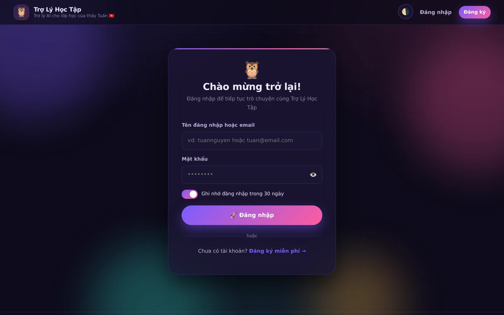

### 3.2. Đăng ký

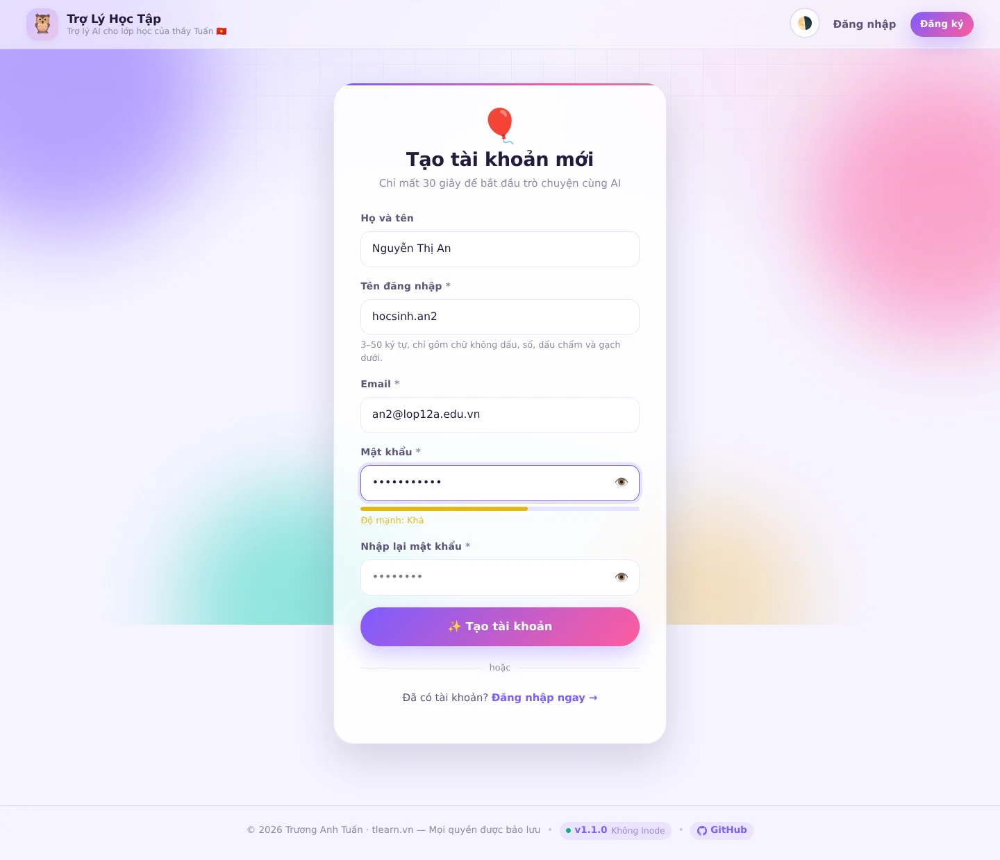

- Tên đăng nhập: 3–50 ký tự, chỉ chữ không dấu, số, dấu chấm và gạch dưới.
- Mật khẩu: tối thiểu 8 ký tự, có cả chữ và số. Thanh màu bên dưới cho biết độ mạnh.
- **Người đăng ký đầu tiên của hệ thống tự động thành quản trị viên.**

> Quản trị viên có thể **tắt đăng ký** trong *Quản trị → Cấu hình web* nếu muốn
> tự cấp tài khoản cho từng người.

---

## 4. Trò chuyện với AI

### 4.1. Màn hình chào

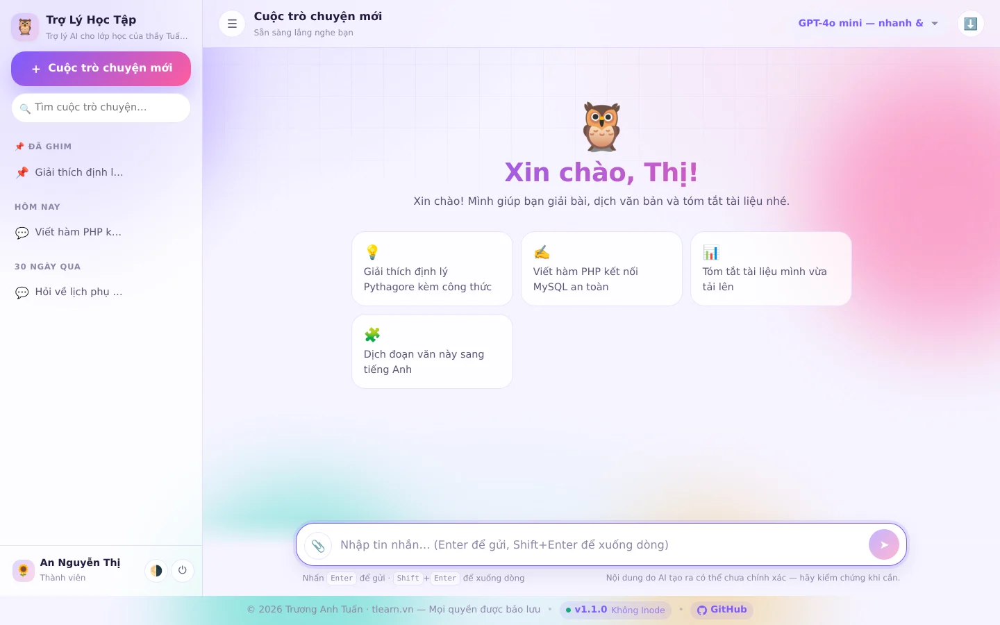

Bốn thẻ gợi ý bên dưới giúp bắt đầu nhanh — bấm vào là nội dung tự điền vào ô soạn tin.
Quản trị viên đổi được các câu này trong *Cấu hình web*.

### 4.2. Gửi tin nhắn

| Thao tác | Cách làm |
|---|---|
| Gửi | Nhấn **Enter** |
| Xuống dòng | **Shift + Enter** |
| Dừng khi AI đang trả lời | Bấm nút **■** (hoặc nhấn **Esc**) |
| Tìm cuộc trò chuyện | **Ctrl + K** |
| Cuộc trò chuyện mới | **Ctrl + Shift + O** |

Câu trả lời hiện dần ra từng chữ (streaming). Nếu bạn bấm dừng giữa luồng,
phần đã nhận **vẫn được lưu lại** và đánh dấu *"⏹ đã dừng"*.

### 4.3. Công thức toán, bảng và khối mã

Nội dung trả về hỗ trợ đầy đủ Markdown và LaTeX:


- Công thức trong dòng: `$a^2 + b^2 = c^2$`
- Công thức riêng dòng: `$$\int_0^1 x^2\,dx$$`
- Cũng nhận cả `\(...\)` và `\[...\]`
- Hệ thống phân biệt được **giá tiền** và **công thức**: `$50` vẫn là năm mươi đô, không bị hiểu thành công thức.

Bảng tự động cuộn ngang khi hẹp, không làm vỡ giao diện:

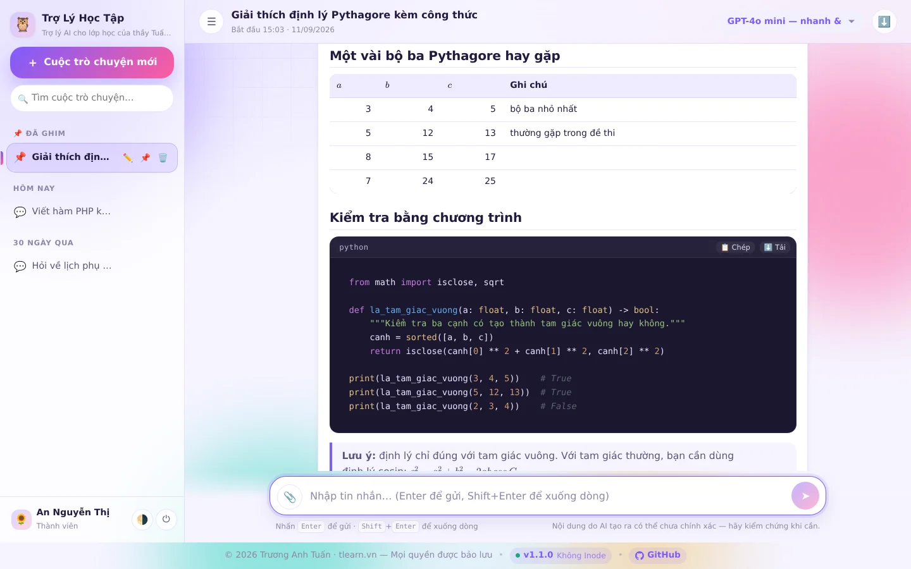

Khối mã được tô màu theo ngôn ngữ, kèm nút **📋 Chép** và **⬇️ Tải** để lưu thành tệp:

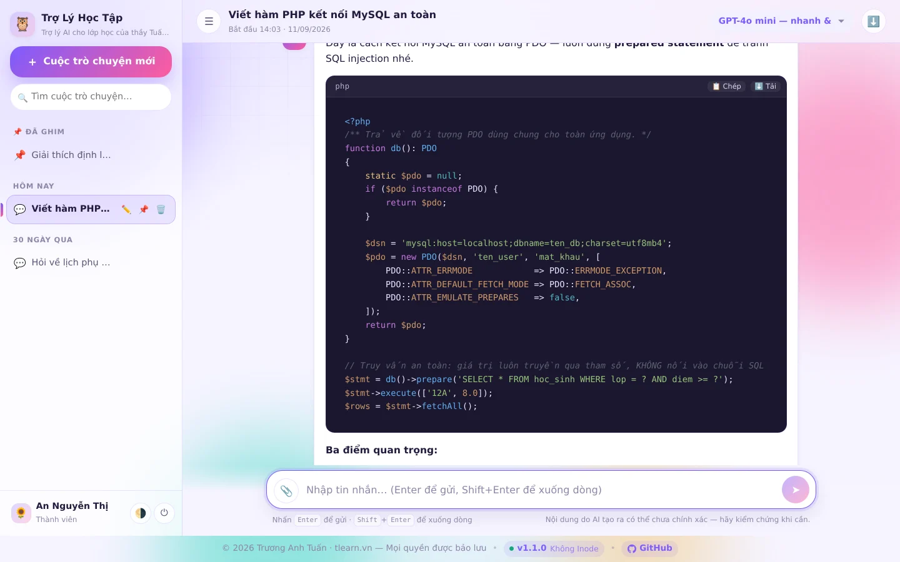

Cuối mỗi câu trả lời có dòng thông tin: thời điểm, tên mô hình, thời gian phản hồi
và số token đã dùng.


### 4.4. Khối suy luận

Với các mô hình có suy luận (DeepSeek R1, Claude thinking, Gemini thinking…),
phần suy nghĩ được gom vào một khối riêng có thể mở ra xem:

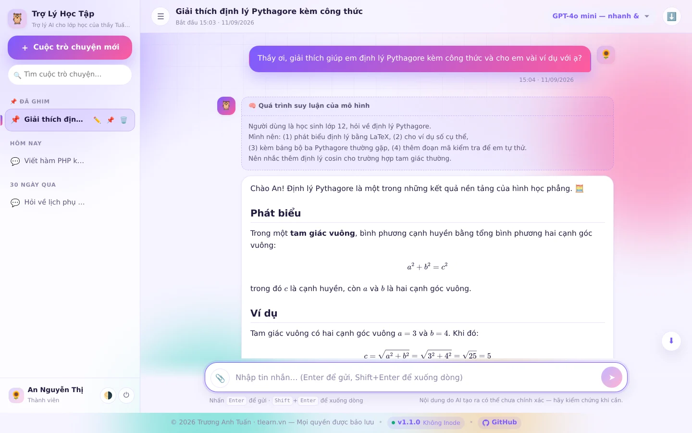

### 4.5. Đính kèm tệp

Ba cách đính kèm:

1. Bấm nút 📎
2. **Kéo–thả** tệp thẳng vào ô soạn tin
3. **Dán ảnh** từ clipboard (Ctrl + V)

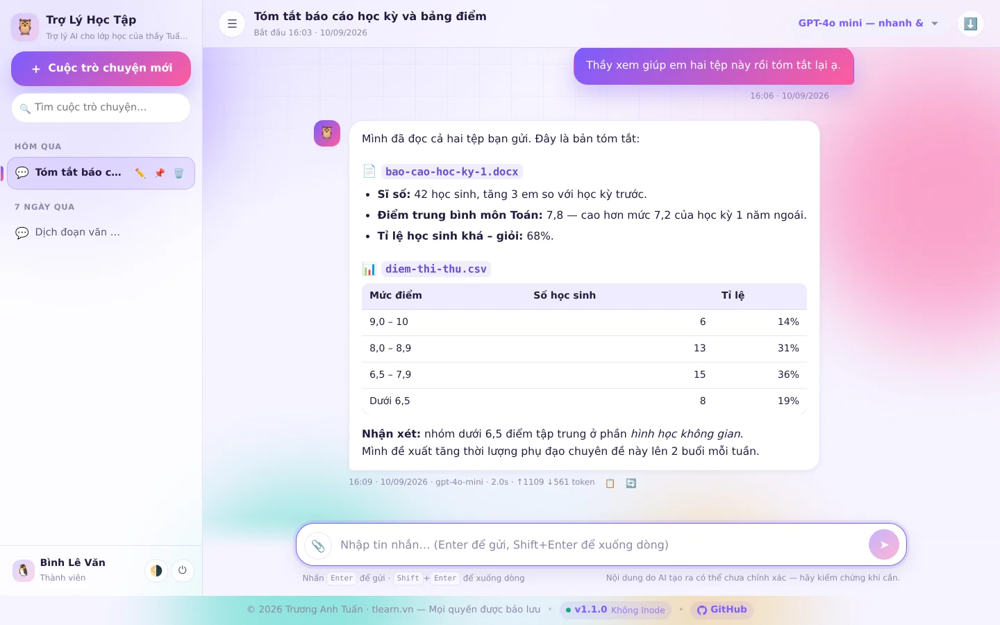

**Hệ thống xử lý từng loại tệp thế nào:**

| Loại tệp | Cách xử lý |
|---|---|
| **PDF** có chữ | Tự đọc chữ trong tệp (kể cả tiếng Việt có dấu, PDF in từ Chrome/Word/Google Docs) rồi đưa vào ngữ cảnh. Với Anthropic và Gemini thì gửi thẳng cả tệp PDF vì hai họ này đọc được cả bảng biểu, hình vẽ |
| **PDF** scan / chỉ có ảnh | Không có chữ để đọc. Bật *"Nhận tệp"* cho endpoint để gửi nguyên tệp cho mô hình tự nhìn; nếu không, hệ thống báo rõ là chưa đọc được |
| Ảnh (jpg, png, gif, webp…) | Gửi trực tiếp cho mô hình dưới dạng base64 nếu endpoint bật *"Đọc được ảnh"* |
| Word, Excel, PowerPoint (docx, xlsx, pptx) | Đọc phần văn bản trong tệp rồi đưa vào ngữ cảnh |
| OpenDocument (odt, ods, odp) | Đọc phần văn bản trong tệp — dùng cho tệp của LibreOffice và Google Docs |
| Office 97-2003 (doc, xls, ppt) | Vớt được phần chữ nhưng có thể thiếu; nên lưu lại thành .docx hoặc PDF |
| RTF, EPUB | Đọc toàn bộ phần chữ |
| txt, md, csv, tsv, json, xml, mã nguồn, phụ đề srt/vtt | Đọc nguyên nội dung đưa vào ngữ cảnh |
| HTML | Bỏ thẻ, chỉ giữ phần chữ (đỡ tốn token) |
| Tệp nén (zip) | Liệt kê danh sách tệp bên trong kèm dung lượng |
| Âm thanh, video | Gửi trực tiếp cho Gemini; các endpoint khác báo là không xử lý được |

Thẻ tệp cho biết ngay tình trạng của từng tệp:

- *"đã đọc nội dung"* — hệ thống rút được văn bản, mô hình chắc chắn thấy nội dung.
- *"gửi trực tiếp cho AI"* — ảnh hoặc tệp đa phương tiện, do mô hình tự xem.
- *"chưa đọc được nội dung"* (viền cam) — kèm ghi chú nói rõ vì sao và nên làm gì.

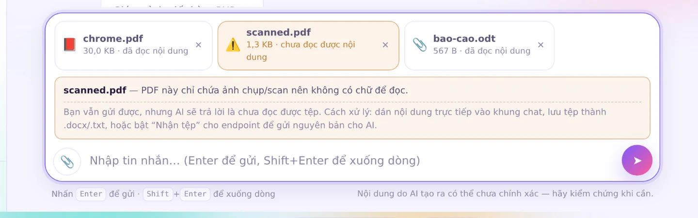

> 🚫 **Không bao giờ có chuyện AI "tóm tắt" một tệp mà nó chưa đọc được.**
> Khi nội dung tệp không tới được mô hình, hệ thống gửi kèm một thông báo buộc
> mô hình phải nói thật là chưa đọc được tệp, tuyệt đối không suy đoán theo tên tệp.

**Nếu tệp chưa đọc được, làm gì?**

| Trường hợp | Cách xử lý |
|---|---|
| PDF scan từ máy photocopy | Bật *"Nhận tệp"* cho endpoint (Anthropic, Gemini, OpenAI) để mô hình tự nhìn; hoặc dùng phần mềm OCR trước |
| PDF dùng phông thiếu bảng Unicode | Mở bằng trình đọc PDF, chọn *In → Lưu thành PDF* để tạo lại tệp |
| PDF đặt mật khẩu | Bỏ mật khẩu rồi tải lên lại |
| Tệp .doc/.xls/.ppt cũ | Lưu lại dưới dạng .docx/.xlsx/.pptx hoặc PDF |
| Ảnh, nhưng endpoint không đọc được ảnh | Chọn endpoint khác có bật *"Đọc được ảnh"* |

### 4.6. Tệp do AI trả về

Nếu mô hình sinh ra ảnh (Gemini `inlineData`, OpenRouter `images`) hoặc nhúng
`data:` URI trong câu trả lời, hệ thống **tự lưu thành tệp tải xuống được** và
thay bằng liên kết — nhờ vậy cơ sở dữ liệu không bị phình vì chuỗi base64 khổng lồ.

### 4.7. Quản lý cuộc trò chuyện

Trong thanh bên, đưa chuột vào một cuộc trò chuyện để thấy ba nút:

| Nút | Chức năng |
|---|---|
| ✏️ | Đổi tên |
| 📌 | Ghim lên đầu danh sách |
| 🗑️ | Xoá vĩnh viễn (cả tệp đính kèm) |

Ô tìm kiếm phía trên tìm cả trong **tiêu đề** và **nội dung tin nhắn**.
Danh sách tự nhóm theo *Đã ghim · Hôm nay · Hôm qua · 7 ngày qua · 30 ngày qua · Cũ hơn*.

Nút **⬇️** ở thanh tiêu đề tải toàn bộ cuộc trò chuyện về máy dưới dạng tệp Markdown.

### 4.8. Chọn mô hình

Hộp chọn ở thanh tiêu đề liệt kê mọi endpoint đang bật. Đổi mô hình giữa cuộc
trò chuyện được — hệ thống ghi nhận mô hình nào đã trả lời tin nhắn nào.

### 4.9. Giao diện tối

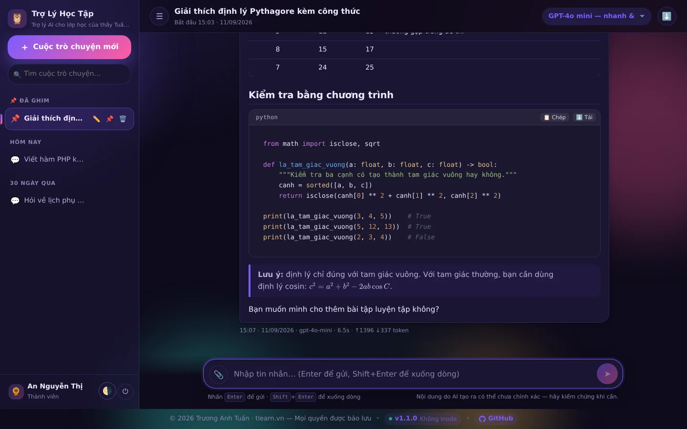

### 4.10. Trên điện thoại

Giao diện responsive hoàn toàn. Thanh bên thu vào, mở ra bằng nút ☰.

<p align="center">
  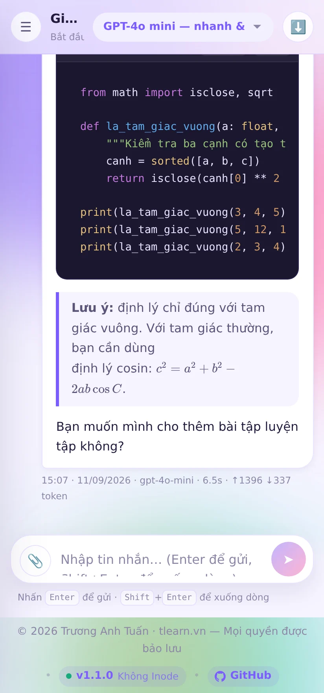
  &nbsp;&nbsp;&nbsp;
  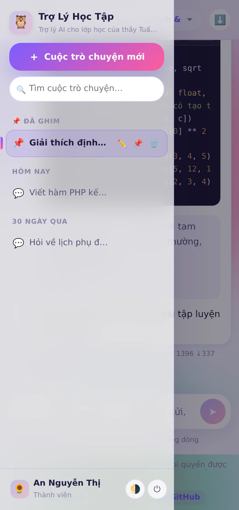
</p>

---

## 5. Quản lý tài khoản

Vào **👤 Tài khoản** (hoặc bấm vào tên bạn ở chân thanh bên).

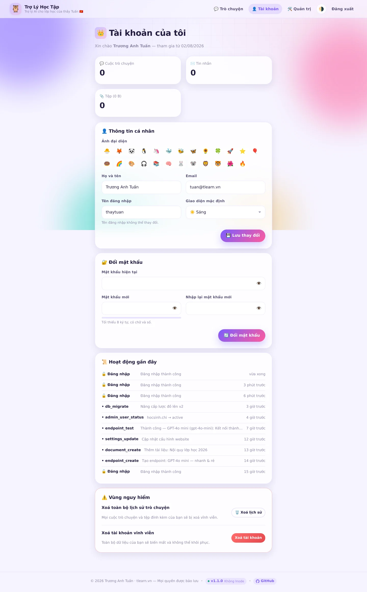

| Khu vực | Làm được gì |
|---|---|
| **Thống kê** | Số cuộc trò chuyện, số tin nhắn, số tệp và dung lượng đã dùng |
| **Thông tin cá nhân** | Chọn emoji đại diện, đổi họ tên, email, giao diện mặc định |
| **Đổi mật khẩu** | Cần mật khẩu hiện tại. Sau khi đổi, **mọi thiết bị khác bị đăng xuất** |
| **Hoạt động gần đây** | 12 hoạt động mới nhất kèm thời điểm |
| **Vùng nguy hiểm** | Xoá toàn bộ lịch sử trò chuyện, hoặc xoá vĩnh viễn tài khoản |

> Tên đăng nhập không đổi được. Quản trị viên duy nhất không thể tự xoá tài khoản
> của mình — hệ thống luôn giữ lại ít nhất một quản trị viên.

---

## 6. Khu vực quản trị

Chỉ tài khoản có quyền **Quản trị viên** vào được, qua nút 🛠️ hoặc `/admin/`.

### 6.1. Tổng quan

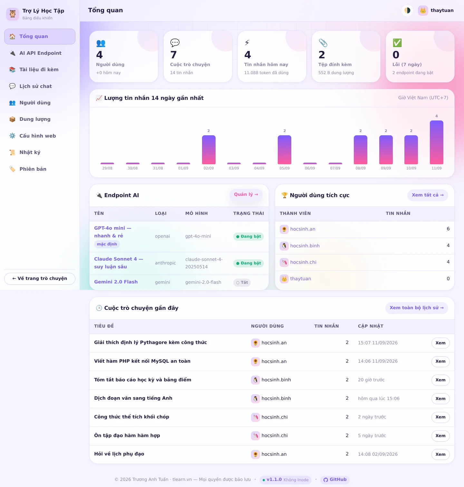

Năm thẻ thống kê, biểu đồ lượng tin nhắn 14 ngày, danh sách endpoint, top người
dùng tích cực và các cuộc trò chuyện gần nhất.

### 6.2. AI API Endpoint

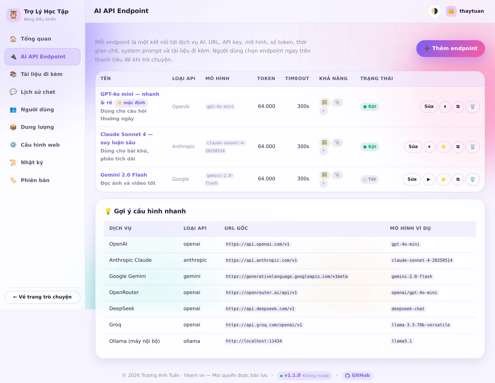

Mỗi endpoint là một kết nối tới dịch vụ AI. Các nút thao tác nhanh:

| Nút | Chức năng |
|---|---|
| ⏸ / ▶ | Tắt / bật endpoint |
| ⭐ | Đặt làm mặc định |
| ⧉ | Nhân bản (tiện khi tạo nhiều biến thể cùng một dịch vụ) |
| 🗑️ | Xoá (các cuộc trò chuyện cũ vẫn được giữ) |

#### Cấu hình chi tiết một endpoint

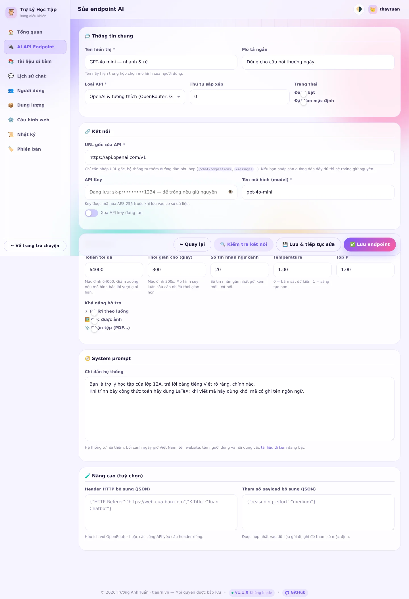

| Trường | Ý nghĩa | Mặc định |
|---|---|---|
| **Tên hiển thị** | Hiện trong hộp chọn mô hình của người dùng | — |
| **Loại API** | `openai` / `anthropic` / `gemini` / `ollama` | `openai` |
| **URL gốc** | Chỉ cần URL gốc, hệ thống tự thêm `/chat/completions`, `/messages`… Nhập sẵn đường dẫn đầy đủ thì hệ thống giữ nguyên | — |
| **API Key** | Được **mã hoá AES-256** trước khi lưu. Để trống khi sửa = giữ key cũ | — |
| **Mô hình** | Tên model của dịch vụ | — |
| **Token tối đa** | Độ dài tối đa câu trả lời | `64000` |
| **Timeout** | Thời gian chờ tối đa | `300` giây |
| **Số tin nhắn ngữ cảnh** | Số tin nhắn gần nhất gửi kèm mỗi lượt hỏi | `20` |
| **Temperature / Top P** | Độ sáng tạo | `1.00` |
| **Trả lời theo luồng** | Tắt nếu hosting chặn streaming | bật |
| **Đọc được ảnh** | Cho phép gửi ảnh cho mô hình | bật |
| **Nhận tệp** | Cho phép gửi PDF cho mô hình | bật |
| **Cách gửi tệp PDF** | `Tự chọn` / `Luôn gửi nguyên tệp` / `Luôn gửi chữ` — xem giải thích dưới | `Tự chọn` |
| **System prompt** | Chỉ dẫn vai trò, giọng điệu, quy tắc trả lời | — |
| **Header HTTP bổ sung** | JSON, hữu ích với OpenRouter | — |
| **Tham số payload bổ sung** | JSON, hợp nhất vào dữ liệu gửi đi | — |

#### Chọn "Cách gửi tệp PDF" thế nào?

PDF là định dạng duy nhất có **hai đường đi** tới mô hình, nên đây là lựa chọn
duy nhất cần đến tay quản trị viên:

| Lựa chọn | Khi nào dùng |
|---|---|
| **Tự chọn** (khuyến nghị) | Gửi nguyên tệp cho Anthropic và Gemini, gửi chữ đã rút cho họ OpenAI. Tệp trên 6 MB mà đã rút được chữ thì gửi chữ để tránh lỗi 413 |
| **Luôn gửi nguyên tệp** | Chỉ khi bạn **chắc chắn** cổng API của mình hỗ trợ khối `{"type":"file"}` và muốn mô hình đọc được cả bảng biểu, hình vẽ trong PDF |
| **Luôn gửi chữ** | Muốn tiết kiệm token tối đa, hoặc PDF của bạn toàn là văn bản thuần |

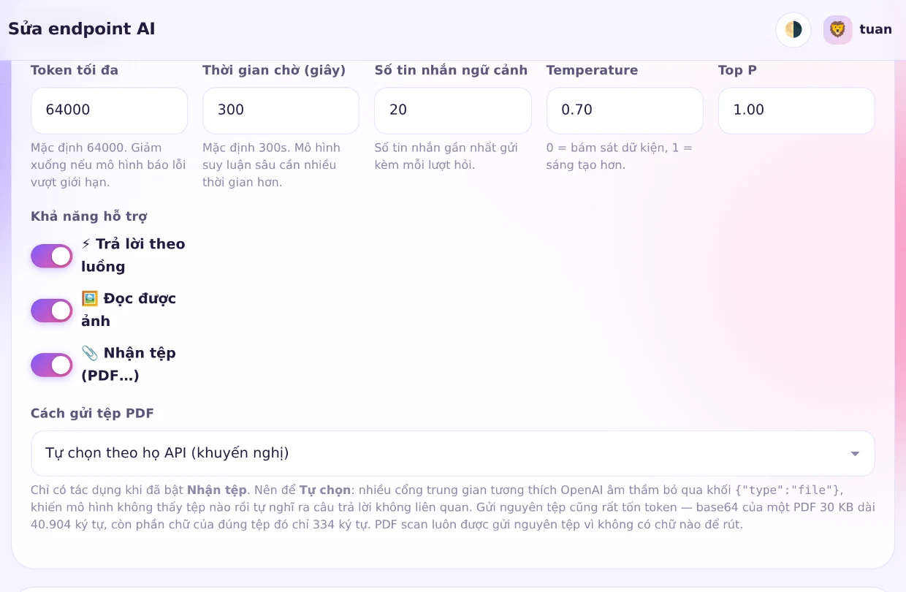

Vì sao mặc định **không** gửi nguyên tệp cho họ OpenAI?

- Khối `{"type":"file"}` là phần mở rộng khá mới. Nhiều cổng trung gian tương thích
  OpenAI (OpenRouter, vLLM, gateway nội bộ của công ty) **âm thầm bỏ qua** nó:
  mô hình không nhận được tệp nào, và khi bạn hỏi *"tóm tắt nội dung"* thì nó trả
  về một câu trả lời nghe rất hợp lý nhưng chẳng liên quan gì tới tệp.
- Gửi nguyên tệp rất tốn token. Base64 phình thêm 1/3 dung lượng và được tính như
  chuỗi ký tự ngẫu nhiên. Một PDF 30 KB thành **40.904 ký tự base64**, trong khi
  phần chữ của đúng tệp đó chỉ **334 ký tự** — chênh hơn 100 lần. Với PDF 300 KB
  thì riêng tệp đã ngốn hơn 100.000 token, vượt cả mức *Token tối đa* mặc định,
  và bị gửi lại ở **mọi lượt hỏi** sau đó vì nằm trong ngữ cảnh.

> 📄 **PDF scan luôn được gửi nguyên tệp**, bất kể lựa chọn này — vì không có
> chữ nào để rút. Còn Word, Excel, ZIP thì **không API nào** nhận nguyên tệp:
> mô hình không tự giải nén được, nên chỉ có một đường là đọc chữ ra trước.

Nút **🔍 Kiểm tra kết nối** gửi một câu hỏi thử ngay lập tức — **không cần lưu trước** —
và báo lỗi bằng tiếng Việt dễ hiểu, ví dụ:

- *"API key không hợp lệ hoặc đã hết hạn."*
- *"Không tìm thấy đường dẫn API hoặc mô hình — hãy kiểm tra lại URL và tên mô hình."*
- *"Hết thời gian chờ sau 300 giây. Hãy tăng Timeout trong cấu hình endpoint."*
- *"Không kết nối được tới máy chủ AI. Có thể hosting đang chặn kết nối ra ngoài."*

Hệ thống tự nối thêm vào system prompt: **ngày giờ hiện tại theo giờ Việt Nam**,
tên website, tên người dùng đang trò chuyện và nội dung các tài liệu đi kèm đang bật.

### 6.3. Tài liệu đi kèm

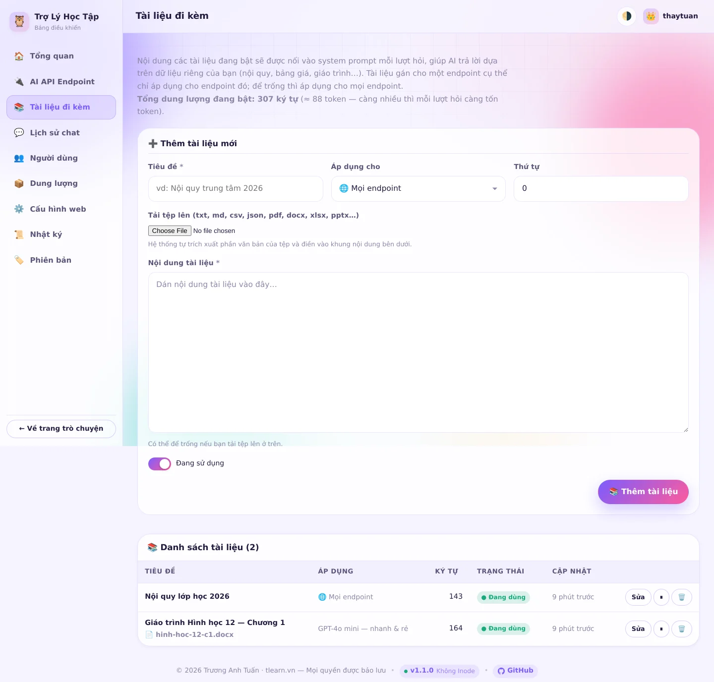

Nội dung các tài liệu đang bật được nối vào system prompt **mỗi lượt hỏi**, giúp
AI trả lời dựa trên dữ liệu riêng của bạn (nội quy, bảng giá, giáo trình…).

- Dán nội dung trực tiếp, **hoặc** tải tệp lên (txt, md, csv, json, pdf, docx, xlsx, pptx) —
  hệ thống tự rút phần văn bản.
- Để **"🌐 Mọi endpoint"** thì áp dụng chung; chọn một endpoint cụ thể thì chỉ endpoint đó dùng.
- Trang hiện tổng số ký tự đang bật và số token tương ứng — càng nhiều tài liệu thì
  **mỗi lượt hỏi càng tốn token**, nên chỉ bật những gì thật cần.

### 6.4. Lịch sử chat toàn hệ thống

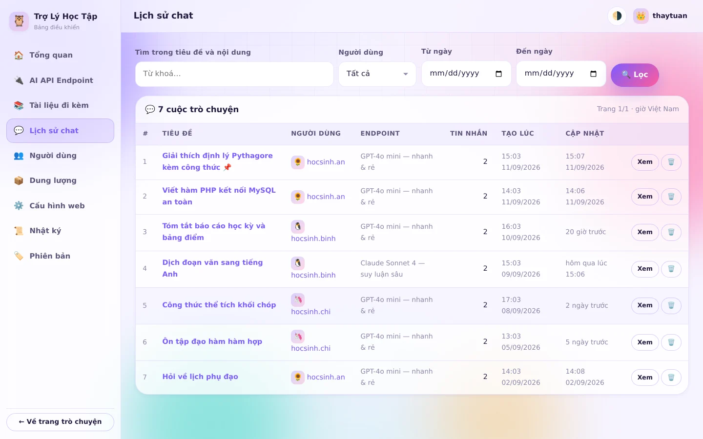

Lọc theo người dùng, từ khoá (tìm cả trong nội dung tin nhắn) và khoảng ngày.

Bấm **Xem** để đọc lại nguyên văn — đầy đủ ảnh, tệp đính kèm, công thức LaTeX
và khối mã, đúng như người dùng đã thấy. Nút **🖨️ In / lưu PDF** xuất ra bản in sạch sẽ.

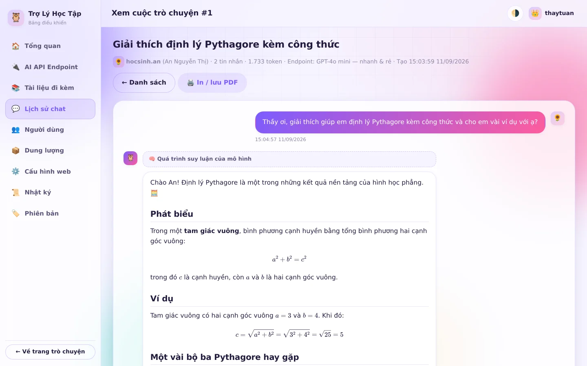

### 6.5. Người dùng

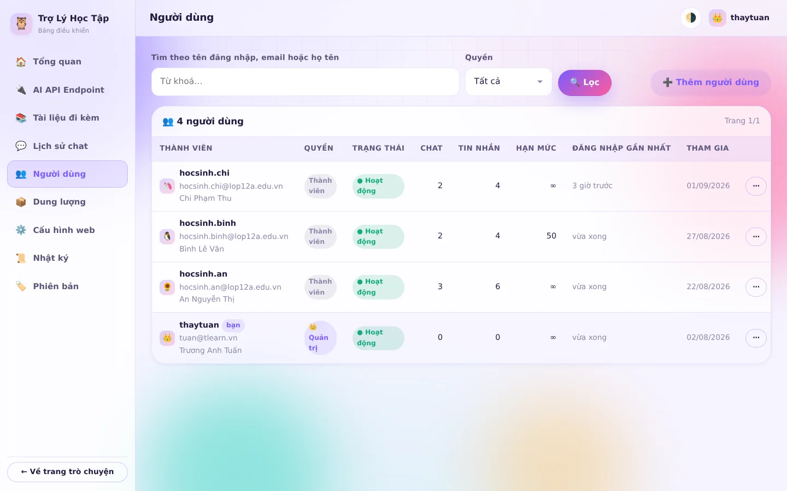

Bấm nút **⋯** ở mỗi dòng để: nâng/hạ quyền, khoá/mở khoá, đặt **hạn mức tin nhắn
mỗi ngày**, đặt lại mật khẩu, hoặc xoá tài khoản.

Hệ thống tự chặn các thao tác nguy hiểm: không thể tự khoá hay tự xoá tài khoản
đang dùng, và không thể hạ quyền/khoá/xoá **quản trị viên cuối cùng**.

> Hạn mức `0` nghĩa là không giới hạn. Khi người dùng dùng hết lượt trong ngày,
> hệ thống báo: *"Bạn đã dùng hết N lượt hỏi trong ngày hôm nay. Hẹn gặp lại vào ngày mai nhé!"*

### 6.6. Dung lượng & phiên

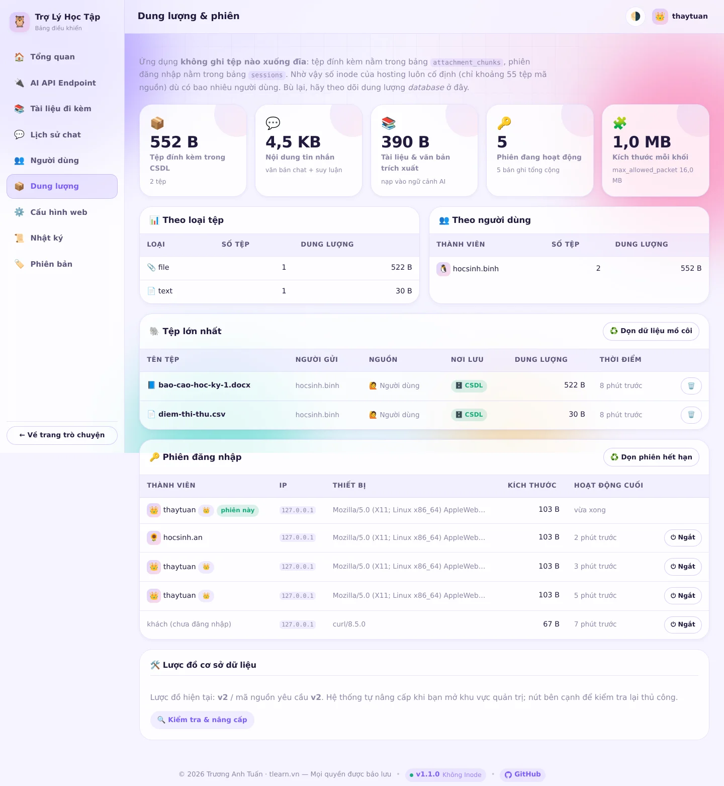

Vì mọi dữ liệu nằm trong MySQL, đây là trang để theo dõi **dung lượng database**:

- Dung lượng tệp đính kèm, nội dung tin nhắn, tài liệu — chia theo **loại tệp** và **người dùng**.
- Danh sách **tệp lớn nhất**, xoá được từng tệp.
- Danh sách **phiên đăng nhập** đang hoạt động kèm IP và thiết bị; **ngắt** từng phiên
  hoặc dọn phiên hết hạn. Người bị ngắt sẽ bị đăng xuất ngay lập tức.
- Nút dọn **dữ liệu mồ côi** và nút kiểm tra/nâng cấp **lược đồ cơ sở dữ liệu**.

> Nếu bạn nâng cấp từ bản trước 1.1.0, trang này hiện thêm nút **🚚 Chuyển tệp vào
> cơ sở dữ liệu** để dời tệp cũ từ `uploads/` vào MySQL theo từng lô. Sau khi
> chuyển hết, xoá được hẳn thư mục `uploads/`.

### 6.7. Cấu hình web

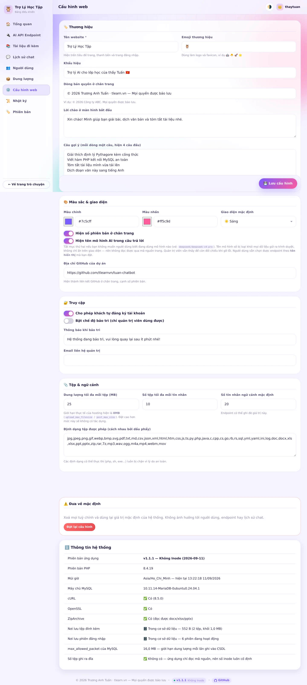

| Nhóm | Tuỳ chỉnh được |
|---|---|
| **Thương hiệu** | Tên website, emoji thương hiệu (làm luôn favicon), khẩu hiệu, **dòng bản quyền ở chân trang**, lời chào, 4 câu gợi ý |
| **Màu sắc & giao diện** | Màu chính, màu nhấn, giao diện mặc định sáng/tối, hiện/ẩn số phiên bản, **hiện/ẩn tên mô hình AI**, địa chỉ GitHub |
| **Truy cập** | Bật/tắt đăng ký, chế độ bảo trì kèm thông báo, email liên hệ |
| **Tệp & ngữ cảnh** | Dung lượng tối đa mỗi tệp, số tệp mỗi tin nhắn, số tin nhắn ngữ cảnh, danh sách định dạng được phép |

Cuối trang là bảng **Thông tin hệ thống**: phiên bản PHP, MySQL, múi giờ, có cURL /
OpenSSL / ZipArchive hay không, dung lượng tệp trong CSDL, số phiên đang hoạt động
và `max_allowed_packet` của MySQL.

> Các định dạng có thể thực thi (`php`, `sh`, `exe`…) **luôn bị chặn**, dù bạn có
> thêm vào danh sách cho phép. Ô nhập cũng từ chối lưu nếu bạn thử thêm chúng.

#### Ẩn tên mô hình AI

Mặc định, cuối mỗi câu trả lời có ghi tên mô hình đã dùng, ví dụ
`deepseek/deepseek-v4-pro`. Nếu bạn không muốn người dùng biết mình đang dùng
dịch vụ nào, hãy **tắt** *"Hiện tên mô hình AI trong câu trả lời"* trong
*Cấu hình web → Màu sắc & giao diện*.

Khi tắt:

| | |
|---|---|
| Người dùng thường | Không thấy tên mô hình ở bất kỳ đâu. Tên mô hình bị **loại khỏi mọi dữ liệu gửi ra trình duyệt**, không chỉ ẩn bằng CSS — nên cũng không đọc được qua *View source* hay công cụ nhà phát triển. |
| Quản trị viên | Vẫn thấy bình thường, để còn đối chiếu khi gỡ lỗi. |
| Cơ sở dữ liệu | Vẫn lưu tên mô hình thật của từng tin nhắn, nên *Lịch sử chat* trong khu quản trị không mất thông tin. |
| Hộp chọn mô hình | Vẫn hoạt động — người dùng chọn theo **tên hiển thị** mà bạn tự đặt cho endpoint (vd: *"Trợ lý nhanh"*, *"Trợ lý suy luận sâu"*). |

> 💡 Vì người dùng chọn endpoint theo tên hiển thị, bạn nên đặt tên thân thiện
> thay vì để trùng tên mô hình — như vậy việc ẩn mới trọn vẹn.

### 6.8. Nhật ký

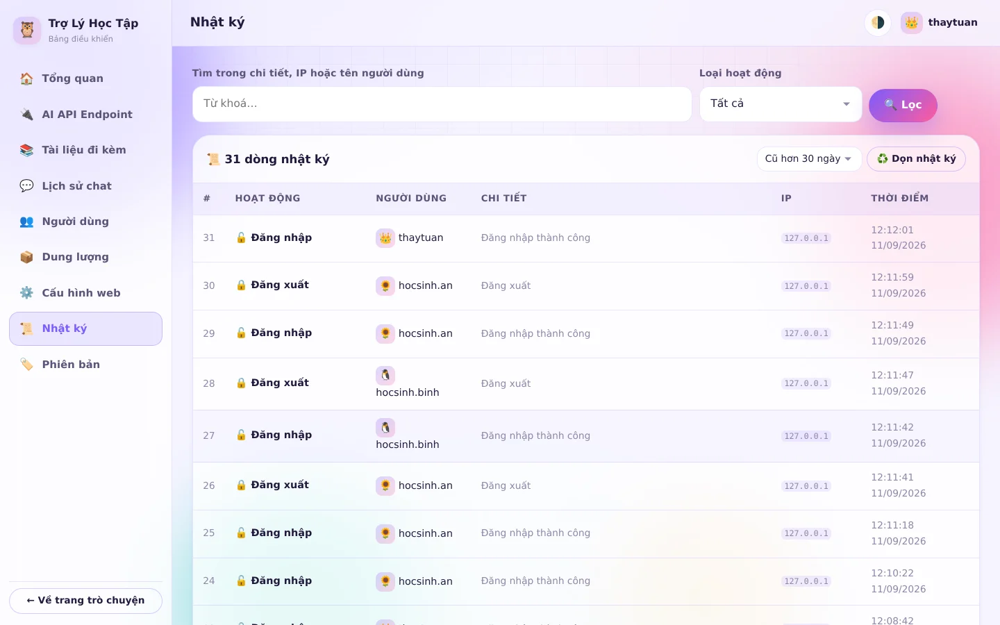

Ghi lại mọi hoạt động đáng chú ý kèm IP và thiết bị: đăng nhập (kể cả **thất bại**),
tạo/sửa/xoá endpoint, kiểm tra kết nối, thêm tài liệu, đổi quyền, nâng cấp lược đồ…
Lọc theo loại hoạt động hoặc từ khoá, và dọn các dòng cũ hơn 7/30/90 ngày.

### 6.9. Phiên bản

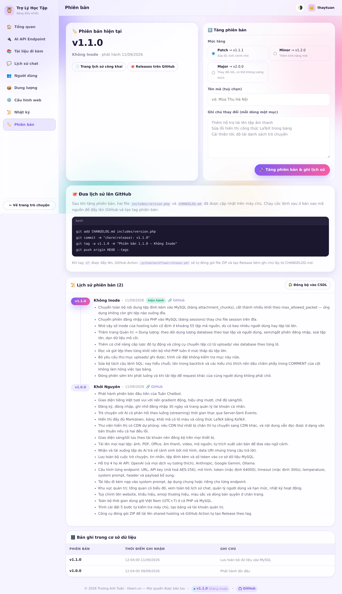

Chọn mức tăng (**Patch** sửa lỗi · **Minor** thêm tính năng · **Major** thay đổi lớn),
nhập tên mã và ghi chú thay đổi rồi bấm **🚀 Tăng phiên bản**. Hệ thống tự:

1. Ghi số mới vào `includes/version.php` → hiện ngay ở **chân trang** mọi trang.
2. Thêm một mục vào đầu `CHANGELOG.md`.
3. Lưu vào bảng `app_versions`.

Trang cũng in sẵn các lệnh Git để đẩy lịch sử lên GitHub và tạo tag.

Người dùng xem được lịch sử này ở trang công khai `/changelog.php`:

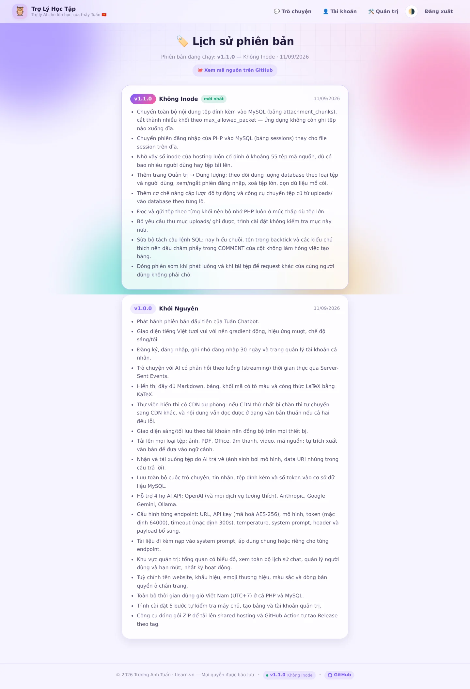

---

## 7. Câu hỏi thường gặp

### Chữ không hiện dần mà ra một lần?

Hosting đang đệm đầu ra. Thử theo thứ tự:

1. Kiểm tra `.htaccess` còn nguyên phần tắt gzip cho `api/stream.php`.
2. Nếu vẫn vậy, tắt **"Trả lời theo luồng"** trong cấu hình endpoint — câu trả lời
   sẽ hiện một lần nhưng vẫn hoạt động bình thường.

### Báo *"Hết thời gian chờ sau 300 giây"*

Tăng **Timeout** của endpoint, và nhờ hosting tăng `max_execution_time` của PHP
lên tương ứng.

### Báo *"Không kết nối được tới máy chủ AI"*

Hosting đang chặn kết nối ra ngoài. Nhờ nhà cung cấp mở cURL tới tên miền của
dịch vụ AI bạn dùng.

### Công thức toán hiện ra dạng `$...$` thay vì công thức đẹp

Thư viện hiển thị (KaTeX) không tải được. Hệ thống thử hai CDN khác nhau, nếu cả
hai đều bị chặn thì nội dung vẫn đọc được ở dạng văn bản thuần và có thông báo
nhắc bạn kiểm tra kết nối tới CDN.

### Tải tệp lớn thì báo lỗi

Giới hạn thật nằm ở PHP. Xem mục **Thông tin hệ thống** trong *Cấu hình web* để
biết giới hạn hiện tại, rồi nhờ hosting tăng `upload_max_filesize` và `post_max_size`.

### Báo *"Không lưu được nội dung tệp vào cơ sở dữ liệu"*

`max_allowed_packet` của MySQL quá nhỏ. Hệ thống đã tự cắt tệp thành khối theo giá
trị này, nhưng nếu dưới 1MB thì nên nhờ hosting tăng lên.

### Database gần hết quota

Vào *Quản trị → Dung lượng*: xem danh sách tệp lớn nhất và xoá bớt. Cũng nên giảm
**Dung lượng tối đa mỗi tệp** trong *Cấu hình web* để hạn chế từ đầu.

### Hay bị đăng xuất

Bảng `sessions` bị dọn quá sớm. Nhờ hosting tăng `session.gc_maxlifetime` của PHP.

### Quên mật khẩu quản trị

Chạy câu lệnh sau trong phpMyAdmin (thay `MatKhauMoi123` bằng mật khẩu bạn muốn,
rồi lấy chuỗi băm bằng `password_hash()` của PHP):

```sql
UPDATE users SET password_hash = '<chuỗi băm>' WHERE username = 'ten_dang_nhap';
```

Hoặc tạo file PHP tạm trên hosting:

```php
<?php echo password_hash('MatKhauMoi123', PASSWORD_DEFAULT);
```

Chạy nó để lấy chuỗi băm, dán vào câu SQL trên, rồi **xoá file tạm ngay**.

### Làm sao để người dùng không biết tôi dùng mô hình nào?

Tắt *"Hiện tên mô hình AI trong câu trả lời"* trong *Cấu hình web*, và đặt
**tên hiển thị** của endpoint theo ý bạn thay vì trùng tên mô hình.
Xem chi tiết ở mục [Ẩn tên mô hình AI](#ẩn-tên-mô-hình-ai).

### Muốn đổi tên website hoặc dòng bản quyền

*Quản trị → Cấu hình web → Thương hiệu*. Có hiệu lực ngay, không cần sửa mã nguồn.

### Nâng cấp lên phiên bản mới thế nào?

1. **Sao lưu database** trước (phpMyAdmin → Export).
2. Giải nén gói mới, **ghi đè** toàn bộ trừ `config/config.php`.
3. Mở khu vực quản trị — hệ thống tự nâng cấp lược đồ cơ sở dữ liệu.
4. Nếu cần, vào *Dung lượng* để kiểm tra lại lược đồ thủ công.

---

<p align="center">
  <a href="README.md">← Về mục lục tài liệu</a> ·
  <a href="QUY-TRINH-KY-THUAT.md">Quy trình kỹ thuật →</a>
</p>
