# 🔧 Quy trình kỹ thuật Tuấn Chatbot

> Tài liệu dành cho lập trình viên · phiên bản **v1.1.0**
> Mọi sơ đồ trong tài liệu này viết bằng Mermaid nên GitHub hiển thị trực tiếp.

---

## Mục lục

1. [Kiến trúc tổng thể](#1-kiến-trúc-tổng-thể)
2. [Cấu trúc mã nguồn](#2-cấu-trúc-mã-nguồn)
3. [Vòng đời một request](#3-vòng-đời-một-request)
4. [Luồng phản hồi theo thời gian thực (SSE)](#4-luồng-phản-hồi-theo-thời-gian-thực-sse)
5. [Bộ chuyển đổi AI API](#5-bộ-chuyển-đổi-ai-api)
6. [Cơ sở dữ liệu](#6-cơ-sở-dữ-liệu)
7. [Lưu trữ tệp trong cơ sở dữ liệu](#7-lưu-trữ-tệp-trong-cơ-sở-dữ-liệu)
8. [Phiên đăng nhập trong cơ sở dữ liệu](#8-phiên-đăng-nhập-trong-cơ-sở-dữ-liệu)
9. [Pipeline hiển thị Markdown và LaTeX](#9-pipeline-hiển-thị-markdown-và-latex)
10. [Bảo mật](#10-bảo-mật)
11. [Nâng cấp lược đồ](#11-nâng-cấp-lược-đồ)
12. [Quy trình phát hành](#12-quy-trình-phát-hành)
13. [Công thức mở rộng](#13-công-thức-mở-rộng)

---

## 1. Kiến trúc tổng thể

Ứng dụng là một PHP truyền thống không framework: mỗi trang là một file `.php`,
dùng chung một lớp `includes/`. Không có build step, không có Composer.

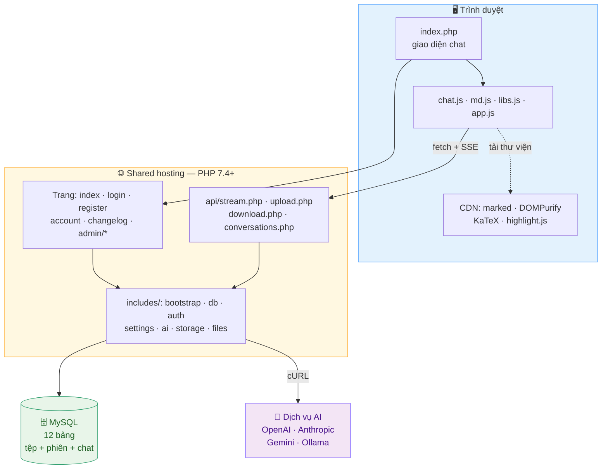

**Nguyên tắc thiết kế**

| Nguyên tắc | Vì sao |
|---|---|
| Không framework, không Composer | Giải nén là chạy trên mọi shared hosting |
| Không ghi tệp xuống đĩa | Shared hosting giới hạn inode rất chặt |
| Mọi truy vấn qua prepared statement | Chống SQL injection tận gốc |
| Lớp `includes/` thuần hàm, không class trừ khi cần | Dễ đọc, dễ sửa, không cần autoloader |
| Thư viện hiển thị nạp từ CDN | Gói ZIP nhẹ (168 KB) và ít inode |

---

## 2. Cấu trúc mã nguồn

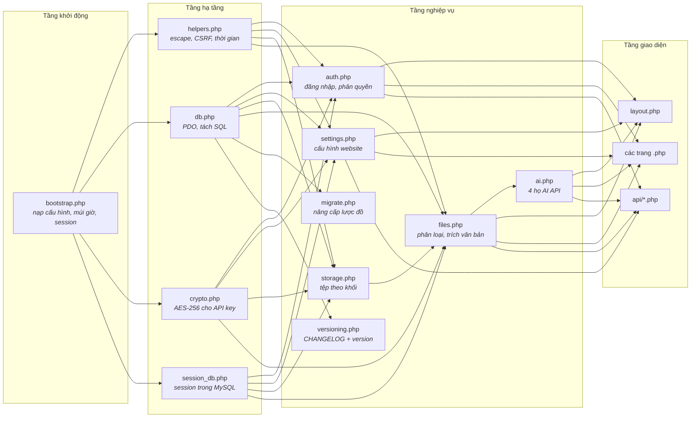

Thứ tự nạp trong `bootstrap.php` **bắt buộc** theo đúng dãy này vì
`session_set_save_handler()` phải được gọi *trước* `session_start()`, mà bộ xử lý
session lại cần PDO:

```php
config → múi giờ → helpers → crypto → db → session_db
       → session_use_database() → session_start()
       → settings → auth → storage → files
```

---

## 3. Vòng đời một request

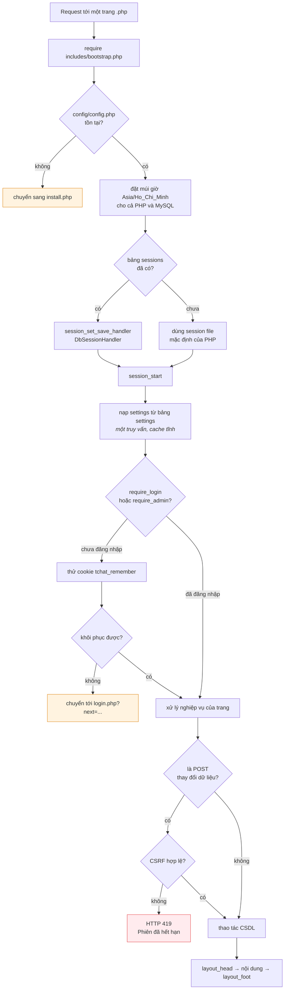

---

## 4. Luồng phản hồi theo thời gian thực (SSE)

`api/stream.php` là trái tim của ứng dụng. Nó vừa là proxy tới dịch vụ AI, vừa là
nơi ghi lịch sử chat.

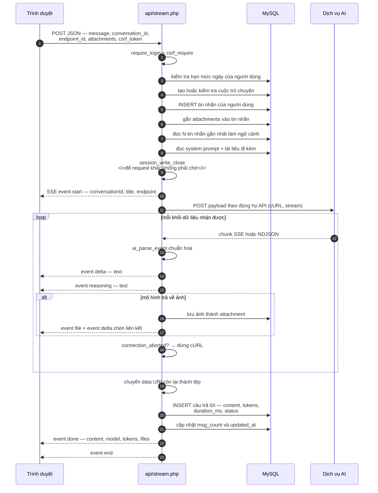

### Điểm kỹ thuật quan trọng

| Vấn đề | Cách xử lý |
|---|---|
| Hosting đệm đầu ra | Gửi 2 KB khoảng trắng mở màn, `X-Accel-Buffering: no`, tắt `zlib.output_compression`, `ob_end_clean()` mọi lớp đệm |
| gzip làm nghẽn luồng | `CURLOPT_ENCODING = 'identity'` khi streaming, để nén khi không streaming |
| Người dùng bấm Dừng | `connection_aborted()` trong callback ghi của cURL → trả `0` để dừng; `ignore_user_abort(true)` giúp phần đã nhận **vẫn được lưu** với `status = 'aborted'` |
| Người dùng đóng tab giữa luồng | Như trên — không bao giờ để lại tin nhắn treo |
| Khoá phiên chặn request khác | `session_write_close()` ngay trước khi phát luồng |
| Quá thời gian thực thi | `set_time_limit(timeout + 60)` |
| Lỗi giữa luồng | Ghi phần đã nhận, `status = 'error'`, kèm `error_message`; giao diện hiện nút *Thử lại* |

### Các sự kiện SSE

| Event | Dữ liệu | Ý nghĩa |
|---|---|---|
| `start` | `conversationId`, `userMessageId`, `title`, `isNew`, `endpoint` | Đã ghi tin nhắn, bắt đầu gọi AI |
| `delta` | `text` | Một mẩu nội dung mới |
| `reasoning` | `text` | Một mẩu suy luận |
| `file` | `id`, `name`, `url`, `mime`, `size`, `kind` | Đã lưu một tệp do AI trả về |
| `done` | `messageId`, `content`, `model`, `tokens`, `durationMs`, `files` | Hoàn tất, kèm nội dung cuối cùng |
| `error` | `message`, `messageId` | Lỗi — nội dung dở vẫn được lưu |
| `end` | `{}` | Đóng luồng |

> Trình duyệt nhận luồng bằng `fetch()` + `ReadableStream` chứ không dùng
> `EventSource`, vì `EventSource` chỉ hỗ trợ GET mà ta cần POST một payload JSON.

---

## 5. Bộ chuyển đổi AI API

`includes/ai.php` quy bốn họ API khác nhau về **một giao diện duy nhất**:

```php
ai_stream($endpoint, $history, $system, [
    'onDelta'     => function ($text) { ... },
    'onReasoning' => function ($text) { ... },
    'onFile'      => function ($file) { ... },
    'onUsage'     => function ($usage) { ... },
    'onMeta'      => function ($meta) { ... },
    'shouldStop'  => function () { return false; },
]);
```

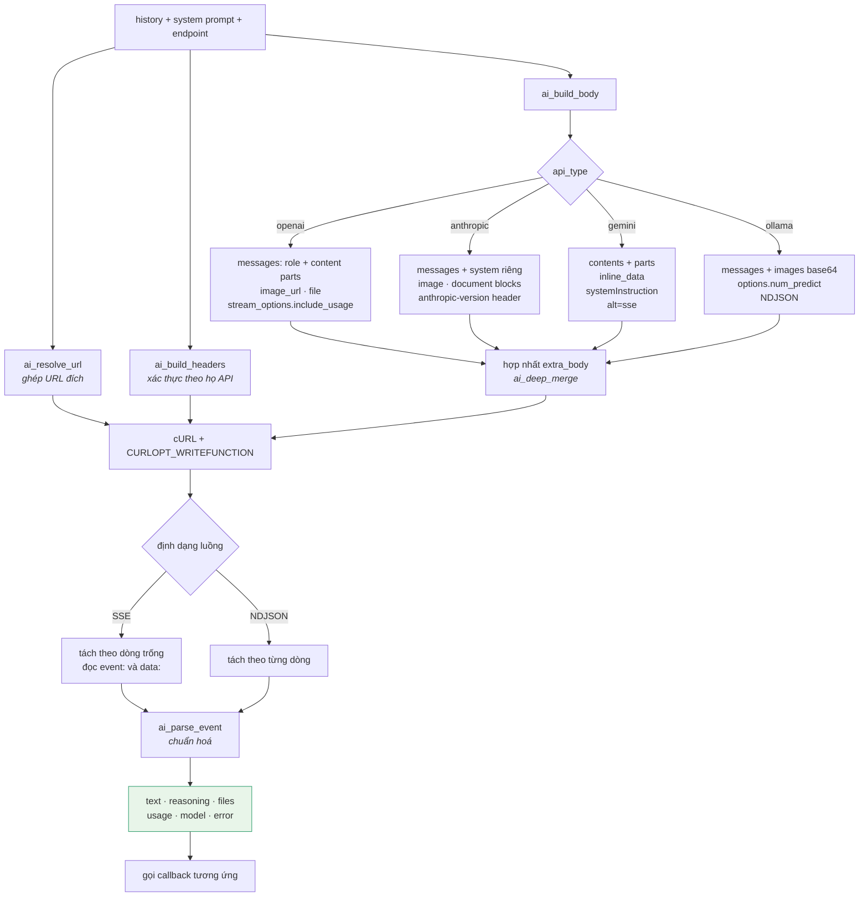

### Ghép URL — `ai_resolve_url()`

Người dùng chỉ cần nhập URL gốc; hàm này tự thêm đường dẫn và **giữ nguyên** nếu
đã có sẵn đường dẫn đầy đủ:

| Loại | Nhập vào | Thành |
|---|---|---|
| `openai` | `https://api.openai.com/v1` | `…/v1/chat/completions` |
| `openai` | `https://x.com/api` | `…/api/v1/chat/completions` |
| `openai` | `…/v1/chat/completions` | giữ nguyên |
| `anthropic` | `https://api.anthropic.com/v1` | `…/v1/messages` |
| `gemini` | `https://…/v1beta` | `…/v1beta/models/{model}:streamGenerateContent?alt=sse` |
| `ollama` | `http://localhost:11434` | `…/api/chat` |

### Tệp đính kèm thành payload

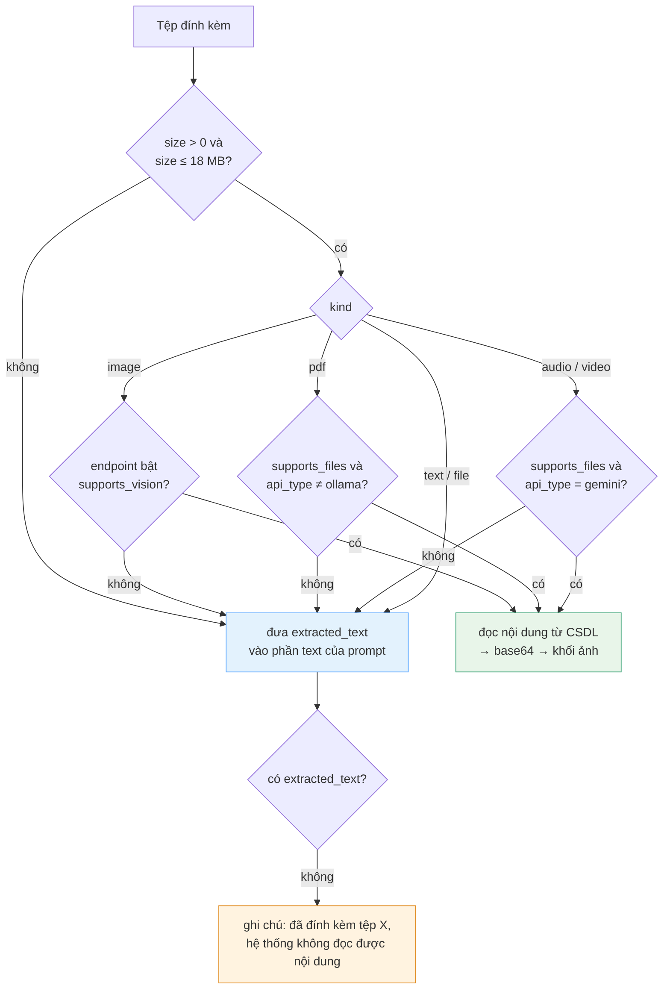

### Diễn giải lỗi

`ai_humanize_http_error()` và `ai_humanize_curl_error()` đổi mã lỗi thành câu
tiếng Việt kèm hướng xử lý — người quản trị không phải tra cứu:

| Mã | Thông báo |
|---|---|
| 401 | API key không hợp lệ hoặc đã hết hạn |
| 403 | API key không có quyền truy cập mô hình này |
| 404 | Không tìm thấy đường dẫn API hoặc mô hình — hãy kiểm tra lại URL và tên mô hình |
| 413 | Nội dung gửi đi quá lớn (tệp đính kèm hoặc lịch sử trò chuyện quá dài) |
| 429 | Đã vượt hạn mức gọi API. Vui lòng thử lại sau ít phút |
| 503 | Máy chủ AI đang quá tải. Vui lòng thử lại |
| `CURLE_OPERATION_TIMEOUTED` | Hết thời gian chờ sau N giây. Hãy tăng "Timeout" trong cấu hình endpoint |
| `CURLE_COULDNT_CONNECT` | Không kết nối được tới máy chủ AI. Có thể hosting đang chặn kết nối ra ngoài |

Phần chi tiết do nhà cung cấp trả về được nối vào sau chữ *"Chi tiết:"*.

---

## 6. Cơ sở dữ liệu

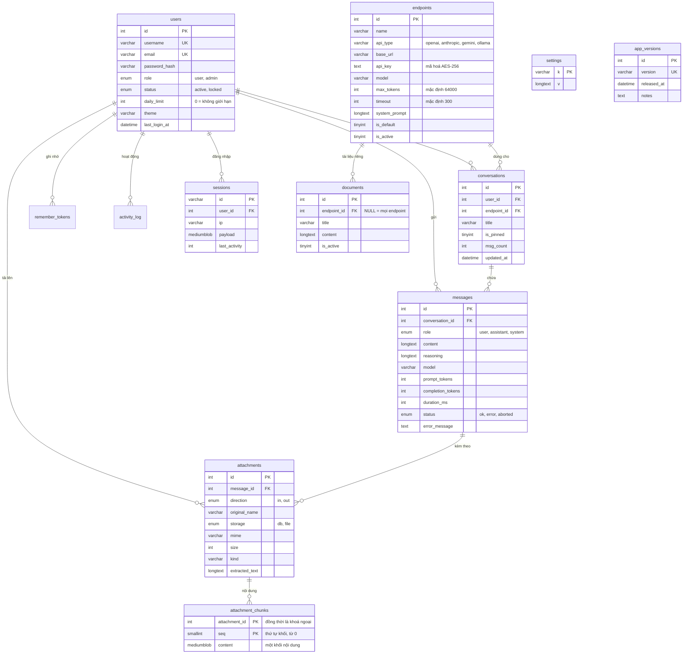

### Nguyên tắc về lược đồ

| | |
|---|---|
| **Bộ mã** | `utf8mb4` / `utf8mb4_unicode_ci` trên mọi bảng — tiếng Việt và emoji đều đúng |
| **Khoá ngoại** | `ON DELETE CASCADE` khắp nơi: xoá người dùng là sạch toàn bộ dấu vết, không cần dọn tay |
| **Blob tách riêng** | Nội dung tệp ở bảng riêng để `SELECT * FROM attachments` luôn nhẹ |
| **Múi giờ** | Ứng dụng tự sinh thời gian bằng PHP, đồng thời `SET time_zone = '+07:00'` cho mỗi kết nối |

### Bộ tách câu lệnh SQL

`db_split_sql()` không cắt đơn thuần theo dấu `;` mà hiểu chuỗi nháy đơn/kép, tên
trong backtick và cả ba kiểu chú thích. Nhờ vậy một dấu `;` nằm trong phần
`COMMENT` của cột không làm việc tạo bảng dừng giữa đường:

```sql
`storage` ENUM('db','file') NOT NULL DEFAULT 'db'
          COMMENT 'db = trong attachment_chunks; file = bản cũ trong uploads/'
--                                              ↑ dấu ; này từng làm vỡ installer
```

---

## 7. Lưu trữ tệp trong cơ sở dữ liệu

### Vì sao không ghi ra đĩa

Shared hosting thường giới hạn **inode** (số tệp + thư mục) ở mức 100.000–300.000.
Mỗi tệp người dùng tải lên, mỗi ảnh AI sinh ra và mỗi phiên đăng nhập nếu đều
thành một tệp thì sớm muộn cũng chạm giới hạn — và khi chạm, hosting **khoá luôn
việc ghi**, kể cả ghi log hay ghi session.

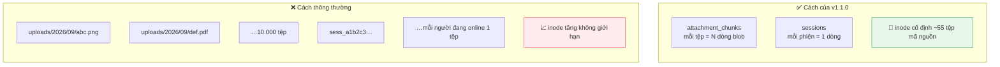

**Đã đo thực tế:** 12 request sau khi cài đặt (8 khách + 4 lần đăng nhập) cùng
31 tệp đính kèm, 20 tin nhắn và 18 phiên → số inode giữ nguyên **74 → 74**.

### Cắt khối

Nội dung tệp không lưu thành một blob khổng lồ mà cắt thành nhiều khối nhỏ:

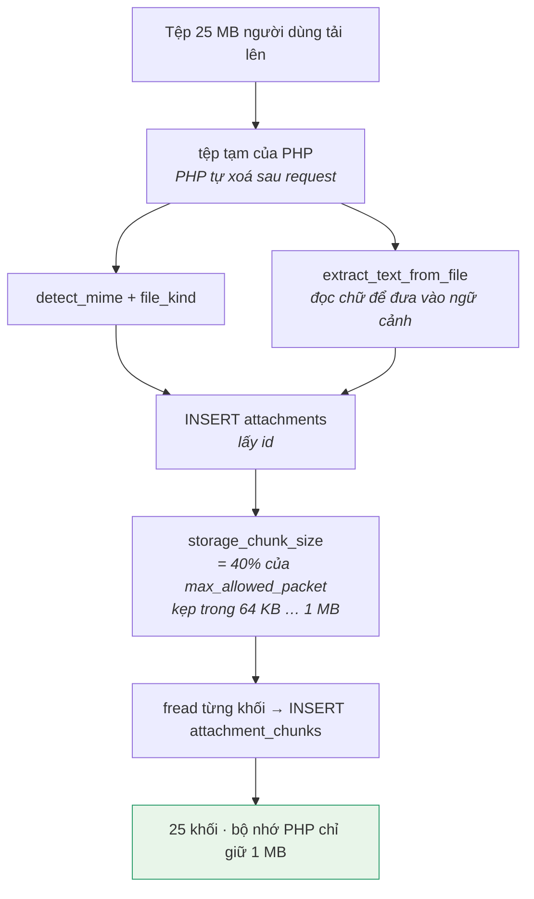

Vì sao phải cắt:

1. **`max_allowed_packet`** của MySQL trên shared hosting thường chỉ 4–16 MB.
   Một `INSERT` chứa 25 MB sẽ bị từ chối. Kích thước khối tự tính theo giá trị thật
   của máy chủ nên không phụ thuộc cấu hình từng nơi.
2. **Bộ nhớ PHP.** Đọc và gửi theo khối giữ mức dùng bộ nhớ gần như không đổi.
   Đo thực tế với tệp 2,9 MB: đọc theo khối đỉnh **6 MB**, nạp cả tệp đỉnh **8 MB** —
   khoảng cách nới rộng theo kích thước tệp.

### Đọc lại

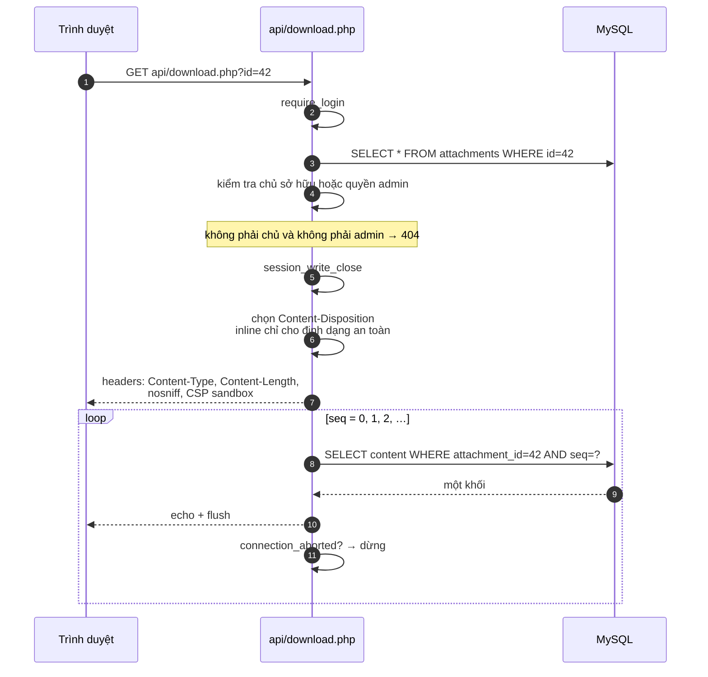

Lấy **từng khối bằng một truy vấn riêng** thay vì `ORDER BY seq` một lần, vì PDO
của MySQL mặc định nạp sẵn toàn bộ tập kết quả vào bộ nhớ — cách này đánh đổi
N truy vấn nhỏ để bộ nhớ luôn ở mức thấp.

### API của lớp lưu trữ

| Hàm | Việc |
|---|---|
| `storage_chunk_size()` | Kích thước khối, tính theo `@@max_allowed_packet` |
| `storage_put($id, $binary)` | Ghi nội dung từ bộ nhớ |
| `storage_put_from_file($id, $path)` | Ghi từ tệp trên đĩa, đọc theo khối |
| `storage_get($id, $maxBytes)` | Đọc toàn bộ (trả `null` nếu vượt ngưỡng) |
| `storage_passthru($id)` | Đẩy trực tiếp ra trình duyệt theo khối |
| `storage_size($id)` · `storage_exists($id)` | Dung lượng thật · đã có nội dung chưa |
| `storage_total_bytes()` | Tổng dung lượng toàn hệ thống |
| `storage_purge_orphans()` | Dọn khối không còn bản ghi tương ứng |

Lớp `files.php` bọc thêm một tầng để hỗ trợ cả bản ghi cũ:

```php
attachment_binary($row, $maxBytes)  // storage = 'db' → CSDL; 'file' → đọc đĩa
attachment_passthru($row)
attachment_available($row)
attachment_legacy_path($row)        // chỉ dành cho bản ghi cũ
```

---

## 8. Phiên đăng nhập trong cơ sở dữ liệu

`DbSessionHandler` hiện thực `SessionHandlerInterface`, đăng ký trong
`bootstrap.php` **trước** `session_start()`:

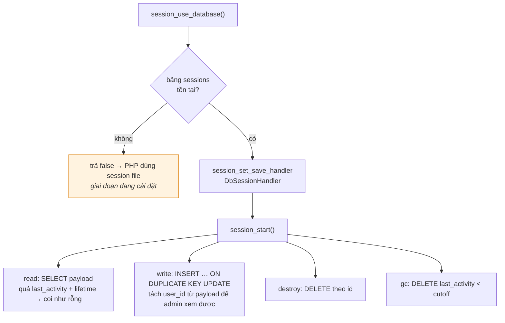

**Ba điểm đáng nói**

1. Mọi phương thức bọc `try/catch`: CSDL lỗi thì session coi như rỗng chứ không
   làm sập trang.
2. `write()` rút `user_id` từ chuỗi đã tuần tự hoá (`/user_id\|i:(\d+);/`) để trang
   *Dung lượng & phiên* hiển thị được ai đang online và **ngắt** được từng phiên.
3. Bộ xử lý **không khoá dòng**, nên nhiều request song song của cùng một người
   không chặn nhau. Đo thực tế: trong lúc một luồng SSE đang chảy, ba request
   `conversations.php` khác trả về trong **14–19 ms**.

---

## 9. Pipeline hiển thị Markdown và LaTeX

Vấn đề cốt lõi: Markdown và LaTeX tranh nhau các ký tự `_`, `*`, `\`. Nếu chạy
Markdown trước, `x_1` trong công thức biến thành chữ in nghiêng.

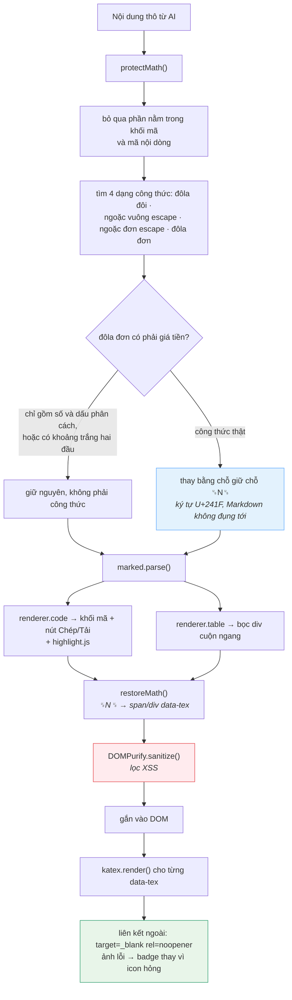

`protectMath()` có **16 test đơn vị** phủ các trường hợp biên: giá tiền, dấu `$`
lẻ, công thức trong khối mã, nháy đơn nhân đôi, ma trận nhiều dòng, `P(A|B)` có
dấu `|`, dấu `$` đã escape…

### Nạp thư viện có dự phòng

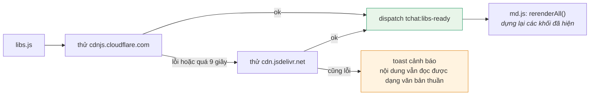

`md.js` giữ một sổ đăng ký `{node, text}` của mọi khối đã dựng, nên khi thư viện
tới muộn thì dựng lại đúng những khối đang hiển thị — người dùng chỉ thấy nội
dung "đẹp lên", không bị mất gì.

### Vẽ Markdown trong lúc đang stream

Mỗi `event: delta` không dựng lại ngay mà gom vào `requestAnimationFrame`, rồi
dựng toàn bộ nội dung đã tích luỹ và chèn con trỏ nhấp nháy. Công thức LaTeX chưa
đóng thì tạm nằm ở dạng chữ cho tới khi mẩu `$` cuối cùng tới.

---

## 10. Bảo mật

```mermaid
flowchart TB
    subgraph L1["1 · Tầng máy chủ"]
        A1[".htaccess chặn config includes sql tools"]
        A2["Options -Indexes · chặn dotfile · chặn .md .sql"]
        A3["nosniff · X-Frame-Options · Referrer-Policy"]
    end
    subgraph L2["2 · Tầng phiên"]
        B1["session HttpOnly · SameSite=Lax · Secure khi HTTPS"]
        B2["use_strict_mode · regenerate_id khi đăng nhập"]
        B3["CSRF token cho mọi thao tác ghi → HTTP 419"]
    end
    subgraph L3["3 · Tầng xác thực"]
        C1["password_hash bcrypt · tự nâng cấp thuật toán"]
        C2["chống dò: 10 lần sai/IP trong 15 phút + delay 0,4s"]
        C3["remember token: selector công khai + validator băm"]
        C4["đổi mật khẩu → huỷ mọi remember token"]
    end
    subgraph L4["4 · Tầng dữ liệu"]
        D1["100% prepared statement"]
        D2["API key mã hoá AES-256-CBC + HMAC-SHA256"]
        D3["kiểm tra chủ sở hữu ở mọi truy vấn attachment và conversation"]
    end
    subgraph L5["5 · Tầng tệp"]
        E1["chặn tuyệt đối php phtml phar sh exe… bất kể cấu hình"]
        E2["không có URL trực tiếp tới tệp — chỉ qua download.php"]
        E3["SVG coi như văn bản thuần · buộc tải xuống định dạng lạ"]
        E4["CSP sandbox + nosniff khi trả tệp"]
    end
    subgraph L6["6 · Tầng hiển thị"]
        F1["DOMPurify lọc mọi HTML do AI sinh"]
        F2["e() escape mọi biến in ra từ PHP"]
        F3["katex trust=false · strict=ignore"]
    end
    L1 --> L2 --> L3 --> L4 --> L5 --> L6
```

### Mã hoá API key

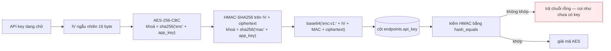

`app_key` là chuỗi ngẫu nhiên 64 ký tự do trình cài đặt sinh, nằm trong
`config/config.php`. **Đổi `app_key` sau khi đã lưu key sẽ làm key cũ không giải
mã được** — khi đó chỉ cần nhập lại key.

Kiểu **encrypt-then-MAC** nghĩa là dữ liệu bị sửa trong CSDL sẽ bị phát hiện chứ
không giải mã ra rác.

---

## 11. Nâng cấp lược đồ

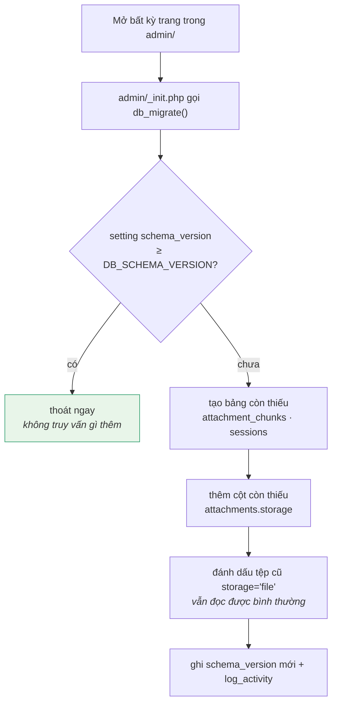

Chuyển tệp cũ sang CSDL là **thao tác tay, theo từng lô** (mặc định 25 tệp/lần) để
không vượt thời gian thực thi của PHP:

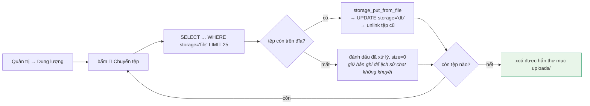

---

## 12. Quy trình phát hành

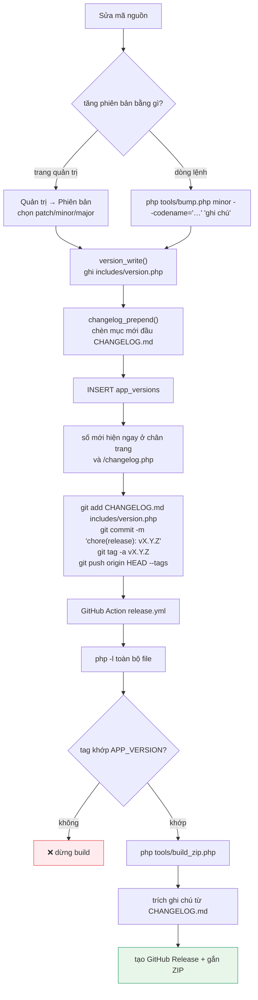

`version_write()` dùng regex hẹp `'[^']*'` nên chỉ thay đúng giá trị của từng hằng
số, không ăn lan sang dòng khác.

### Đóng gói

`tools/build_zip.php` loại bỏ `.git/`, `.github/`, `dist/`, `docs/`,
`config/config.php` và các tệp rác, rồi thêm `DOC-CAI-DAT.txt` vào gói.
Kết quả khoảng **60 tệp, 168 KB** — giải nén lên hosting là chạy được.

```bash
php tools/build_zip.php                 # → dist/tuan-chatbot-<version>.zip
php tools/build_zip.php --out=/tmp/a.zip
php tools/build_zip.php --with-config   # kèm cả config — CẨN THẬN
```

---

## 13. Công thức mở rộng

### Thêm một họ AI API mới

Sửa đúng bốn chỗ trong `includes/ai.php`:

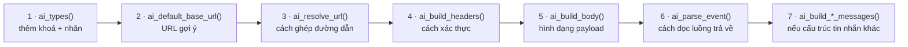

Không cần sửa `api/stream.php` — nó chỉ làm việc với giao diện chuẩn hoá.

### Thêm một trang quản trị

```php
<?php
require_once __DIR__ . '/_init.php';     // đã require_admin() + db_migrate()

if ($_SERVER['REQUEST_METHOD'] === 'POST') {
    csrf_require();
    // … xử lý …
    flash('success', 'Đã lưu!');
    redirect('trang-moi.php');
}

admin_head('Tiêu đề trang', 'khoa_menu');
// … HTML …
admin_foot();
```

Rồi thêm một dòng vào `admin_menu()` trong `admin/_init.php`.

### Thêm một thiết lập website

1. Thêm giá trị mặc định vào `settings_defaults()` trong `includes/settings.php`.
2. Thêm ô nhập vào `admin/settings.php` và tên trường vào mảng `$fields`
   (nếu là checkbox thì thêm cả vào `$checkboxes`).
3. Dùng ở bất kỳ đâu: `setting('khoa_moi')`, `setting_bool(...)`, `setting_int(...)`.

### Thêm một endpoint API

Tạo `api/ten-moi.php`:

```php
<?php
require_once __DIR__ . '/_init.php';

$user = require_login(true);   // true = trả JSON thay vì chuyển hướng
api_require_method('POST');
csrf_require(true);

$giaTri = api_param('ten_tham_so', '');
// … xử lý …

json_out(['ok' => true, 'data' => $giaTri]);
```

### Chạy thử tại máy

```bash
# Máy chủ PHP có sẵn
php -d upload_max_filesize=64M -d post_max_size=80M -S 127.0.0.1:8080 -t .

# Kiểm tra cú pháp toàn bộ
find . -name '*.php' -not -path './.git/*' -exec php -l {} \;

# Kiểm tra cú pháp JavaScript
for f in assets/js/*.js; do node --check "$f"; done
```

Bật `'debug' => true` trong `config/config.php` khi phát triển để thấy lỗi chi
tiết, và **tắt lại** khi chạy thật.

---

<p align="center">
  <a href="README.md">← Về mục lục tài liệu</a> ·
  <a href="HUONG-DAN-SU-DUNG.md">Hướng dẫn sử dụng →</a>
</p>
