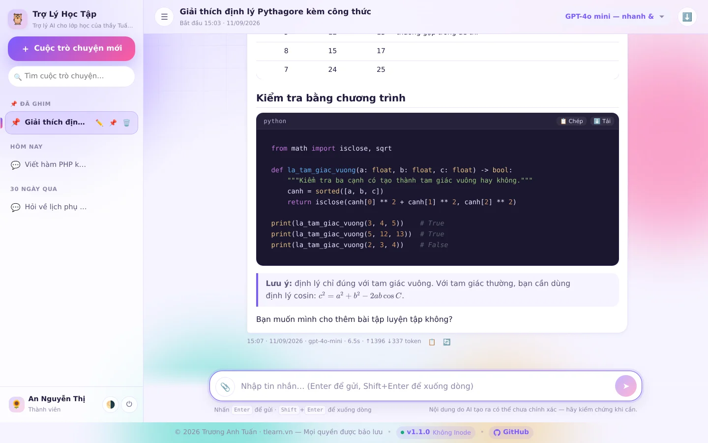

# 📚 Tài liệu Tuấn Chatbot

Tài liệu đầy đủ cho Tuấn Chatbot — xem [CHANGELOG](../CHANGELOG.md) để biết phiên bản mới nhất.

| Tài liệu | Dành cho | Nội dung |
|---|---|---|
| [**Hướng dẫn sử dụng**](HUONG-DAN-SU-DUNG.md) | Người dùng & quản trị viên | Cài đặt từng bước, cách trò chuyện, đính kèm tệp, quản lý tài khoản, toàn bộ khu vực quản trị — kèm ảnh minh hoạ từng màn hình |
| [**Quy trình kỹ thuật**](QUY-TRINH-KY-THUAT.md) | Lập trình viên | Kiến trúc, vòng đời request, luồng streaming SSE, bộ chuyển đổi AI API, lược đồ CSDL, cách lưu tệp theo khối, pipeline hiển thị, bảo mật, quy trình phát hành — kèm sơ đồ |

---

## Bắt đầu nhanh

```bash
# 1. Tạo database MySQL (utf8mb4) trong cPanel/DirectAdmin
# 2. Giải nén gói ZIP vào public_html/
# 3. Cấp quyền ghi cho config/  →  755
# 4. Mở https://ten-mien-cua-ban/install.php
# 5. Xoá install.php sau khi cài xong
```

<p align="center">
  
</p>

---

## Mục lục nhanh

**Hướng dẫn sử dụng**
- [Cài đặt 5 bước](HUONG-DAN-SU-DUNG.md#2-cài-đặt)
- [Trò chuyện với AI](HUONG-DAN-SU-DUNG.md#4-trò-chuyện-với-ai)
- [Đính kèm tệp — các định dạng đọc được](HUONG-DAN-SU-DUNG.md#45-đính-kèm-tệp)
- [Quản lý tài khoản](HUONG-DAN-SU-DUNG.md#5-quản-lý-tài-khoản)
- [Cấu hình AI API Endpoint](HUONG-DAN-SU-DUNG.md#62-ai-api-endpoint)
- [Câu hỏi thường gặp](HUONG-DAN-SU-DUNG.md#7-câu-hỏi-thường-gặp)

**Quy trình kỹ thuật**
- [Kiến trúc tổng thể](QUY-TRINH-KY-THUAT.md#1-kiến-trúc-tổng-thể)
- [Luồng streaming SSE](QUY-TRINH-KY-THUAT.md#4-luồng-phản-hồi-theo-thời-gian-thực-sse)
- [Bộ chuyển đổi AI API](QUY-TRINH-KY-THUAT.md#5-bộ-chuyển-đổi-ai-api)
- [Đọc chữ trong PDF](QUY-TRINH-KY-THUAT.md#đọc-chữ-trong-pdf--includespdfphp)
- [Lược đồ cơ sở dữ liệu](QUY-TRINH-KY-THUAT.md#6-cơ-sở-dữ-liệu)
- [Lưu tệp theo khối](QUY-TRINH-KY-THUAT.md#7-lưu-trữ-tệp-trong-cơ-sở-dữ-liệu)
- [Bảo mật](QUY-TRINH-KY-THUAT.md#10-bảo-mật)
- [Quy trình phát hành](QUY-TRINH-KY-THUAT.md#12-quy-trình-phát-hành)

---

## Về ảnh minh hoạ

Toàn bộ 33 ảnh trong `docs/images/` được chụp **tự động** từ ứng dụng thật đang chạy
(Chromium ở độ phân giải 2×, dữ liệu mẫu của một lớp học), sau đó thu nhỏ về 1440px
và chuyển sang WebP. Không có ảnh nào được chỉnh sửa hay dựng lại bằng tay.
